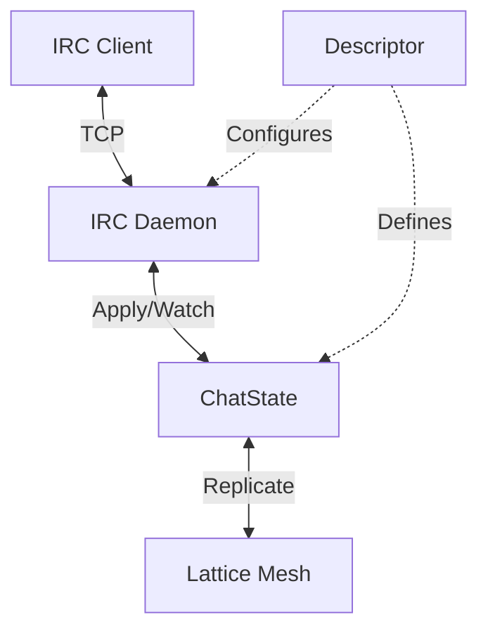

# Lattice Service Architecture

## Overview

Services allow Lattice nodes to interact with the outside world (TCP/HTTP/SSH) or perform background maintenance. This document defines how services are **declared**, **configured**, and **orchestrated** across the mesh.

The architecture distinguishes between **Cluster-wide Definitions** (what services exist) and **Local Runtime** (where they run).

## Core Concepts

### 1. Service Manifest (Definition)

Defines *what* a service is. Currently, these are compiled-in Rust modules (crate feature flags), but future versions may support Wasm or external binaries.

**Defined in Code:**
```rust
pub trait ServiceProvider {
    fn id(&self) -> &str; // e.g. "lattice.irc-gateway"
    fn schema(&self) -> ServiceSchema; // Config validation
    fn factory(&self) -> Box<dyn ServiceFactory>;
}
```

### 2. Service Registry (Cluster Configuration)

Services are declared cluster-wide in the **System Table (rootstores)** (the coordination layer). This allows coherent configuration management across the mesh.

**Storage Path:** `/services/{service_id}/config`

**Example Config (JSON/TOML):**
```toml
[lattice.irc-gateway]
enabled = true
# Distribution Policy: Global, LocalOnly, or TaggedNodes
policy = "TaggedNodes(gateway)" 
default_port = 6667
channels = ["#general", "#dev"]
```

### 3. Node Assignment (Runtime)

Each node watches the System Table. If a node matches the `policy` for a service, it instantiates the service locally using the `LatticeService` trait.

- **Global**: Runs on every node in the mesh (e.g., `HealthCheck`).
- **LocalOnly**: Configured only in local `meta.db` (e.g., `PersonalDashboard`).
- **TaggedNodes**: Runs on nodes with specific tags (e.g., `IRC-Gateway`).

## The External Daemon Pattern

You are right. To ensure stability and security, **Daemons should be external processes**.

The `lattice-node` core should remain small, focused, and rock-solid. All application logic runs in separate processes that communicate via a simple **Lattice Store Protocol** (RPC).

### Architecture: The "Kernel & User-Space" Model

1.  **Lattice Node (The Kernel)**
    -   Manages the Disk (DB), The Network (P2P), and Consistency (Conflict Resolution).
    -   Exposes a **Unix Domain Socket** (or localhost TCP).
    -   Does **NOT** know about IRC, HTTP, or FUSE.

2.  **Daemons (User Space)**
    -   Standalone binaries: `lattice-irc`, `lattice-fuse`, `lattice-web-gateway`.
    -   Connect to the Node's socket.
    -   Authenticate with a **Service Token**.
    -   Send simple Ops: `put(key, val)`, `watch(prefix)`.

### The Protocol (Lattice Store Protocol - LSP)

The interface is defined in `lattice-rpc` using Protocol Buffers. It provides a simple, strongly-typed API for processes to interact with the Lattice Node.

```protobuf
syntax = "proto3";
package lattice.rpc;

import "lattice/proto/storage.proto"; // Imports SignedIntention, HLC

service LatticeController {
    // 1. Connection & Capabilities
    rpc Connect(ConnectRequest) returns (ConnectResponse);
    
    // 2. Store Management
    // Opens a handle to a specific store (KV, Log, etc.)
    rpc OpenStore(OpenStoreRequest) returns (StoreHandleResponse);
}

service LatticeStore {
    // 1. Key-Value Operations
    // Standard KV ops. If the store is a conflict-free map, these are atomic.
    rpc Get(GetRequest) returns (GetResponse);
    rpc Put(PutRequest) returns (PutResponse);
    rpc Delete(DeleteRequest) returns (DeleteResponse);
    
    // 2. Range Scans
    rpc Scan(ScanRequest) returns (stream ScanResponse);
    
    // 3. Live Updates (Reactive)
    // Crucial for IRC: "Notify me when /channels/#general/messages changes"
    rpc Watch(WatchRequest) returns (stream WatchEvent);
}

// -- Messages --

message ConnectRequest {
    string service_id = 1;      // e.g. "lattice-irc"
    string auth_token = 2;      // Token from environment variable
    string version = 3;         // Protocol version
}

message ConnectResponse {
    string session_id = 1;
    NodeInfo node_info = 2;
}

message OpenStoreRequest {
    string store_id = 1;        // UUID of the store
    optional string create_as_type = 2; // If missing, create as "kv"
}

message WatchRequest {
    string store_id = 1;
    bytes key_prefix = 2;       // e.g. "messages/"
}

message WatchEvent {
    oneof event {
        Intention put = 1;          // New value written
        bytes delete = 2;       // Key deleted
    }
}
```

This interface is **Simple yet Powerful**:
-   **Connect**: Authenticates the daemon.
-   **OpenStore**: Gets access to a specific dataset (e.g., the Chat Store).
-   **Watch**: The "Killer Feature" for daemons. The IRC daemon doesn't need to poll; it just subscribes to the `messages/` prefix and forwards new messages to TCP clients instantly.

### Why this is better
-   **Crash Isolation**: If `lattice-irc` panics, the Node (and your data) stays up.
-   **Security**: The Node enforces ACLs on the socket. `lattice-irc` can only read `/chat/*`, not `/passwords/*`.
-   **Polyglot**: Write a daemon in Python, Go, or Node.js easily.
-   **Distribution**: `cargo install lattice-irc` is optional.

### 4. Service Discovery (State)

Running services advertise their presence back to the Mesh Root Store so other nodes can discover them.

**Storage Path:** `/nodes/{node_id}/services/{service_id}`

**Content:**
```json
{
  "status": "Running",
  "endpoints": ["tcp://10.0.0.5:6667"],
  "uptime": 3600
}
```

## Multi-Mesh Flexibility

A key requirement is that a Node can participate in **Multiple Meshes**, and identical services (e.g., "IRC Gateway") might be active in both.

### The Service Instance

A running service is identified by the tuple `(StoreID, ServiceID)`.
-   Store A (Work): `lattice-irc`
-   Store B (Hobby): `lattice-irc`

This requires the **External Daemon** model to spawn **two separate processes**:
1.  `lattice-irc --store-id <A> --socket /tmp/lattice.sock --port 6667`
2.  `lattice-irc --store-id <B> --socket /tmp/lattice.sock --port 6668`

### Resolving Port Conflicts

If both meshes request port `6667` by default:
1.  **Conflict Detected**: The `ServiceManager` sees a port collision on the Node.
2.  **Resolution Strategy**:
    -   **Manual**: The user adds a Local Override in `meta.db` mapping `MeshB:lattice-irc:port` to `6668`.
    -   **Dynamic**: If config allows `port: 0`, the OS assigns a random port, and the service reports it back via Service Discovery.

This validates the **External Daemon** choice: We need process isolation to handle conflicting states and configurations across meshes cleanly.

Running services advertise their presence back to the Mesh Root Store so other nodes can discover them.

**Storage Path:** `/nodes/{node_id}/services/{service_id}`

**Content:**
```json
{
  "status": "Running",
  "endpoints": ["tcp://10.0.0.5:6667"],
  "uptime": 3600
}
```

## The Lattice Application Bundle

You have correctly identified the three pillars of a Lattice Application. This "Triad" forms a deployable unit:

1.  **State Machine (The "Brain")**
    -   **Responsibility**: Deterministic business logic, data persistence, conflict resolution.
    -   **Example**: `ChatState` (stores messages, handles specific CRDT merging).
    -   **Nature**: Passive, Replicated, Durable.

2.  **Daemon (The "Body")**
    -   **Responsibility**: Side-effects, I/O, bridging to the outside world (TCP/HTTP), reacting to changes.
    -   **Example**: `IrcService` (listens on 6667, translates generic `Op::Post` to IRC `PRIVMSG`).
    -   **Nature**: Active, Ephemeral, Local.

3.  **Service Descriptor (The "Passport")**
    -   **Responsibility**: Metadata, configuration schema, deployment policy, discovery.
    -   **Example**: `lattice.irc-gateway` manifest (defines port 6667 default, requires `ChatState`).
    -   **Nature**: Static, Declarative.

### Interaction Flow



This separation allows us to upgrade the Daemon (e.g., bug fix in TCP handling) without touching the State Machine (data), and vice-versa.

## Wiring It Together: The Service Lifecycle

How does a bundle become a running process?

### 1. Registration (Compile Time / Startup)
Services are registered with the `Node` at startup. This maps the abstract ID (`lattice.irc-gateway`) to concrete Rust code.

```rust
// lattice-node/src/main.rs
let mut node = NodeBuilder::new()
    .with_service(IrcGatewaySync::new()) // Register the Descriptor
    .build()?;
```

### 2. Initialization (Runtime / Dynamic)
The `ServiceManager` (inside `Node`) runs a reconciliation loop:

1.  **Watch Config**: Monitors `/services/{id}` in the System Table.
2.  **Evaluate Policy**: Checks `should_run(service_id, policy)`.
3.  **Spawn/Kill**:
    -   **Start**: If policy matches + locally consented -> calls `Descriptor.spawn(ctx)`.
    -   **Stop**: If policy no longer matches -> drops the `ServiceHandle` (triggering shutdown).

### 3. The `ServiceContext` Injection
When a service starts, it receives a `ServiceContext`. This is the **Dependency Injection** layer.

```rust
pub struct ServiceContext {
    // 1. Access to State (The Brain)
    pub mesh: MeshHandle,
    // 2. Access to Identity (The Passport)
    pub node_id: PubKey, 
    // 3. Access to Configuration (The Rules)
    pub config: ConfigValue,
}
```

### Example: `IrcDaemon::start`

```rust
async fn start(&self, ctx: ServiceContext) -> Result<()> {
    // 1. Read Config
    let port = ctx.config.get_u16("port").unwrap_or(6667);
    
    // 2. Bind Socket (The Body)
    let listener = TcpListener::bind(("0.0.0.0", port)).await?;
    
    // 3. Open State (The Brain)
    // The Daemon knows which State Machine it needs
    let chat_store = ctx.mesh.open_store("chat-store", ChatState::default()).await?;
    
    // 4. Loop
    loop {
        let (socket, _) = listener.accept().await?;
        // Pass the store handle to the connection handler
        tokio::spawn(handle_connection(socket, chat_store.clone()));
    }
}
```

## Beyond Sockets: OS Integration (FUSE, Tun/Tap)

The "Daemon" concept is not limited to network ports. It encapsulates **ANY** side-effect or OS integration.

### Example: The Shared Drive (FUSE)
A service that mounts a Lattice Store as a local filesystem.

-   **State**: `FileSystemState` (Directory tree CRDT).
-   **Daemon**: `FuseDaemon` (Implements `libfuse` ops).
-   **Config**: `mount_point: "/home/user/lattice-drive"`.
-   **Consent**: **CRITICAL**. A random mesh peer should *never* be able to mount a filesystem on your machine without explicit permission.

### Example: VPN Interface (Tun/Tap)
A service that creates a virtual network interface.

-   **State**: `NetworkState` (IP allocations, routes).
-   **Daemon**: `VpnDaemon` (Reads/Writes to `/dev/net/tun`).
-   **Config**: `cidr: "10.0.0.0/24"`.

### The General Pattern
A Service is simply: **Lattice State** ↔ **OS Resource**.
-   TCP Port ↔ Chat Log
-   FUSE Mount ↔ File Tree
-   TUN Interface ↔ IP Routing Table
-   Desktop Notification ↔ Alert Log


## Critique: Is this "Good"?

This architecture is **powerful** but carries significant risks for a local-first system.

### The "Remote Control" Problem (RCE Risk)
**Risk**: If the root store syncing is automatic, a malicious peer with write access to the root store could push a config: `policy: "All Nodes"`, `port: 22`. Effectively, this is Remote Code Execution (RCE) via configuration.
**Conflict**: This violates the "Local Sovereignty" principle of Lattice (_"My node, my rules"_).

### Refinement: Consent-Based Activation

To mitigate this, we must separate **Cluster Suggestion** from **Local Activation**.

1.  **Cluster Config = "Intention"**: "The mesh administrator *suggests* that all 'gateway' nodes run IRC on 6667."
2.  **Local Config = "Consent"**: The local node must explicitly **opt-in** to managing services via the mesh.

**Revised Policy Check:**
```rust
fn should_run(&self, service_id: &str, policy: Policy) -> bool {
    let local_consent = self.meta.get_service_consent(service_id);
    
    match local_consent {
        Consent::AlwaysAllow => true,
        Consent::Block => false,
        Consent::FollowMesh => self.matches_policy(policy), // The risky but convenient mode
        Consent::Manual => false, // Default: safe
    }
}
```

### The Bootstrapping Paradox
**Problem**: If *all* services are managed this way, how does `lattice-net` start? It needs to be running to fetch the config that says it should run.
**Solution**: Distinction between **Kernel Services** (hardcoded, internal, required for node to function) and **User Services** (dynamic, managed via this architecture).

### Conclusion
This architecture is good **IF** we implement the "Consent Firewall". Without it, it turns a P2P mesh into a botnet command-and-control system.

## Comparative Analysis: How others do it

To validate this design, we compare it to industry standards:

### 1. Kubernetes (The "Cluster Computer" Model)
*   **Approach**: Central Control Plane (API Server) pushes intent (`Deployment`) to Kubelets. Kubelets blindly obey.
*   **Contrast**: Kubernetes assumes the cluster owns the nodes. Lattice assumes nodes are sovereign individuals collaborating.
*   **Verdict**: We borrow K8s' **Declarative Config** (Reconciliation Loops) but reject its **Unchecked Obedience**.

### 2. Systemd (The "Local Init" Model)
*   **Approach**: Unit files on disk describe services. `systemctl enable` activates them.
*   **Contrast**: Purely local. No way to say "Run this on all web-servers".
*   **Verdict**: We borrow Systemd's **Unit Model** (Dependencies, Restart Policy) but add a **Mesh Control Plane**.

### 3. Cap'n Proto / Sandstorm (The "Capability" Model)
*   **Approach**: Services are isolated grains. They can only talk to things they have explicit capabilities (tokens) for.
*   **Contrast**: Extremely secure but complex dev experience.
*   **Verdict**: Our "Consent Firewall" is a simplified Capability model. "I grant this mesh the capability to configure my TCP ports."

### Why this fits Lattice
Lattice intends to be a **Sovereign Mesh**. It needs the fleet management of K8s for convenience, but the hard security boundaries of a personal firewall. The **Manifest + Registry + Consent** triad strikes this balance.
