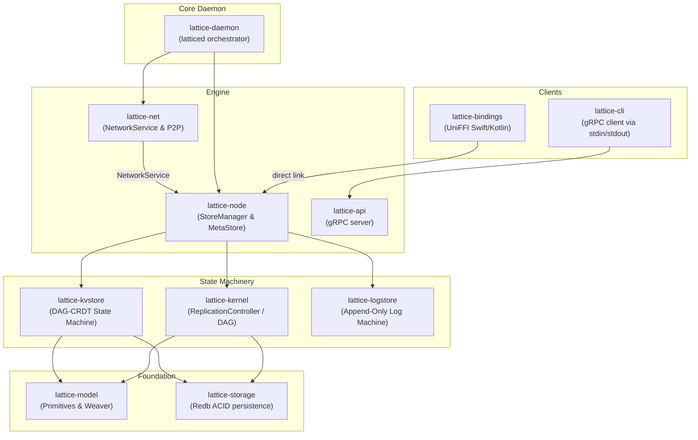

# System Design and Architecture

Lattice's system architecture is designed around the **Flattened Orchestration Pattern**. All coordination is driven purely by a generalized `StoreManager` and `NetworkService`, establishing a strict separation of concerns between storage, replication, and network transport.

## Component Layers

## `StoreManager`: The Heart of the Node

The `StoreManager` is the primary orchestrator inside `lattice-node`. Instead of having independent storage orchestrators for different data types, the `StoreManager` maintains a unified flat registry of all active stores regardless of their underlying type (`KvStore`, `LogStore`).

- **Lifecycle:** It opens, synchronizes, and closes stores.
- **Dependency Injection:** It serves as the provider for context, injecting references to `meta.db` so individual stores can independently verify their own peer authorizations (the `Arc<Self>` pattern).
- **Network Agnostic:** The `StoreManager` does not know how Iroh works. It simply hands `AuthorizedStore` handles to the `NetworkService` when a peer needs to sync.

## The `NetworkService` Interface

`lattice-net` implements the `NetworkService` struct, and it operates as a "dumb bouncer." 

1. **Explicit Registration:** If a `Store` is not explicitly registered with the `NetworkService` locally, the network layer drops all incoming network requests for it. There is no central API to enumerate all private databases on a node.
2. **Contextual Peer Authorization:** When the `NetworkService` receives an Intention stream over the wire, it asks the registered `AuthorizedStore` wrapper: *"Is this peer actually allowed to send data to this specific database?"* 
3. **Transport Layer:** It utilizes Iroh and QUIC connections underneath to traverse NAT and discover peers on local Wi-Fi or across the global internet.

By delegating the permission check to the `AuthorizedStore` rather than the connection layer, Lattice secures data at the DAG-ingestion boundary.
