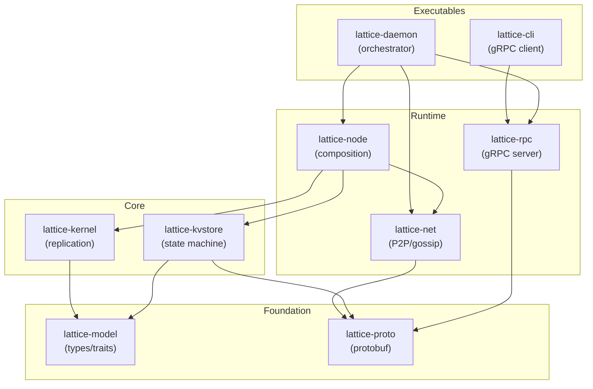

# Architecture

## Terminology

- **Lattice**: The distributed storage system (this software)
- **Node**: A single Lattice instance with its own identity (keypair)
- **Store**: A replicated key-value store with SigChain entries. Can contain references to child stores.
- **Root Store**: *Role* - The top-level store of a hierarchy (e.g. "Home"). Contains peer list and child store declarations.
- **Child Store**: *Role* - A store referenced by a parent store, inheriting peers/config if configured.
- **Mesh**: *Deprecated* - See **Root Store**. A hierarchy of stores sharing a common root.
- **SigChain**: An append-only, hash-chained log of signed entries per author
- **Entry**: A signed, timestamped operation in a SigChain
- **MeshNetwork**: The network layer providing sync/gossip/join operations

## Design Principles

**Core:**
- SigChains: Ed25519-signed, hash-chained append-only logs per node.
- Offline-First: Iroh for networking. Vector clocks identify missing entries on reconnect.
- Full Replication: All nodes keep all logs until watermark consensus, then prune.

**State:**
- Log-Based State: KV store derived from entries. Watermarks enable pruning + snapshots.
- DAG Conflict Resolution: Entries track ancestry. Forks merge on next write. Tips only in state.db.

**Operations:**
- Atomic Batch Writes: Multiple key updates as single entry.
- Conditional Updates (CAS): Update only if current value matches expected hash.

**CRDTs:**
- LWW-Register: Last-writer-wins for single values.
- LWW-Element-Set: Set with add/remove, element present if add > remove timestamp.

## Concepts

- Transitive Pairing: Nodes can introduce new nodes to the mesh.
- **Fractal Stores**: Any store can be a parent to other stores, forming a directory-like hierarchy (ADR 001).
- **Multi-Hierarchy**: A node can participate in multiple disjoint store graphs (e.g. Work vs Personal).
- **Root Store**: The entry point for a hierarchy. Stores `/nodes/{pubkey}/...` and `/stores/{uuid}/...` to manage membership and children.

## Crate Architecture

The system is composed of strictly layered crates to separate concerns:



### 1. `lattice-model` (Base)
- **Responsibility**: Pure data types and traits.
- **Content**: `HLC`, `Hash`, `PubKey`, `Op`, `StateMachine` trait, `LogEntry` trait, `LogManager` trait.
- **Dependencies**: None (pure Rust).

### 2. `lattice-kvstore` (State Machine)
- **Responsibility**: Concrete Key-Value state machine implementation.
- **Content**: `KvState` implementing `StateMachine`, `KvStateActor`, `KvStateHandle`.
- **Client API**: `get()`, `list()`, `put()`, `delete()`, `watch()` - clients interact directly.
- **Storage**: Uses `StorageBackend` trait (see below). Default: `RedbBackend`.
- **Logic**: Handles KV-specific conflicts (LWW, Tombstones, DAG resolution).
- **Dependencies**: `lattice-model`, `lattice-proto`.

### 2b. `StorageBackend` Trait (Planned - M8)

Both `lattice-kvstore` and `lattice-kernel` use a generic storage interface instead of `redb` directly:

```
┌─────────────────────────────────────────┐
│  State Machines (LogStore, KvStore)     │  → writes Collection::Data
├─────────────────────────────────────────┤
│  Kernel (SigChainManager)               │  → writes Collection::Meta
├─────────────────────────────────────────┤
│  StorageBackend trait + Collections     │  ← Defined in lattice-model
├─────────────────────────────────────────┤
│  RedbBackend │ MemoryBackend │ Flash    │  ← Swappable implementations
└─────────────────────────────────────────┘
```

**Column Families (Namespace Isolation):**

| Collection | ID | Purpose | Who writes |
|------------|----|---------|------------|
| `Data`     | 0  | User key-value space | State machine |
| `Meta`     | 1  | Frontiers, tips | Kernel |
| `Index`    | 2  | Sidecar indexes (Negentropy) | Kernel |

**Traits:**
- **`StorageBackend`**: `get(col, key)`, `transaction()`
- **`StorageTransaction`**: `get`, `set`, `delete`, `scan`, `commit`

**Implementations:**
- `RedbBackend`: Maps collections to separate redb tables
- `MemoryBackend`: Prefix-encodes collection ID `[col_id][key]`
- `FlashBackend`: Embedded/RP2350 (sequential-storage)

**Kernel-Owns-Meta Pattern:**

After `state_machine.apply_op()` returns, the kernel writes chain metadata:

```rust
fn ingest_entry(&mut self, entry: SignedEntry, txn: &mut dyn StorageTransaction) {
    // State machine writes to Collection::Data
    self.state_machine.apply_op(&entry.payload, txn);
    
    // Kernel writes to Collection::Meta (state machine can't touch this)
    txn.set(Collection::Meta, &tip_key, &entry.hash)?;
    txn.set(Collection::Meta, &seq_key, &entry.seq.to_le_bytes())?;
    
    txn.commit()?;  // Atomic: both Data and Meta committed together
}
```

**Benefits:**
- User keys can never collide with system metadata
- Wasm guests only see `Collection::Data` — sandboxed
- Atomic consistency between user data and chain state
- Same abstraction works on redb (tables) and embedded (prefix encoding)

### 3. `lattice-kernel` (Replication Engine)
- **Responsibility**: Replication, log management, sync protocol.
- **Components**:
    - **SigChainManager**: Validates signatures, sequences, and hash chains. Manages append-only log files.
    - **ReplicatedState**: The core replication actor - signs entries, maintains log, broadcasts to peers.
- **Key Principle**: Generic over `S: StateMachine`. NO KV-specific commands.
- **Dependencies**: `lattice-model`. **State-machine agnostic**.

### 4. `lattice-net` (The Wire)
- **Responsibility**: P2P Networking and Gossip.
- **Content**: `GossipManager`, `SyncAgent`.
- **Dependencies**: `lattice-proto`, `iroh`.

### 5. `lattice-node` (The Glue)
- **Responsibility**: Runtime composition. Pure library, embeddable in iOS/GUI apps.
- **Action**: Instantiates `ReplicatedState<KvState>`, connects to `Network`.
- **Dependencies**: All above.

### 6. `lattice-daemon` (The Executable)
- **Responsibility**: Thin orchestration layer for headless operation.
- **Content**: Config loading, component wiring, lifecycle management, signal handling.
- **NOT responsible for**: Business logic, networking, storage, RPC handling.
- **Dependencies**: `lattice-node`, `lattice-net`, `lattice-rpc`.

```rust
// Conceptually ~200-500 lines
async fn main() {
    let node = Node::open(&config.data_dir).await?;
    let mesh = MeshService::new(node.clone()).await?;
    let rpc = RpcServer::new(node.clone(), &socket_path)?;
    
    tokio::select! {
        _ = mesh.run() => {},
        _ = rpc.run() => {},
        _ = shutdown_signal() => {},
    }
}
```

### 7. `lattice-cli` (The Client)
- **Responsibility**: Thin gRPC client for user interaction.
- **Content**: Command parsing, RPC calls, output formatting.
- **Dependencies**: `lattice-rpc` (client stubs only).

### Compositional Pattern: ReplicatedState

The combined runtime unit is **`ReplicatedState<S: StateMachine>`**:

```
┌─────────────────────────────────────────────────┐
│        ReplicatedState<S: StateMachine>         │
│                                                 │
│  ┌─────────────────┐    ┌──────────────────┐   │
│  │ ReplicatedState │───▶│   StateMachine   │   │
│  │                 │    │   (e.g. KvState) │   │
│  │ - submit()      │    │                  │   │
│  │ - ingest()      │    │ - apply(op)      │   │
│  │ - sync_state()  │    │ - get() [KV]     │   │
│  │ - subscribe()   │    │ - list() [KV]    │   │
│  └─────────────────┘    └──────────────────┘   │
│                                                 │
│  Exposes: ReplicationEngine + S-specific APIs   │
└─────────────────────────────────────────────────┘
```

**Type aliases for convenience:**
```rust
type KvReplica = ReplicatedState<KvState>;      // KV store
type CounterReplica = ReplicatedState<Counter>; // Ephemeral counter
```

**Key traits (in `lattice-model`):**
- **`StateMachine`**: `apply(op)` - applies operation to state
- **`ReplicationEngine`**: `submit(payload)`, `ingest(entry)`, `sync_state()`

The ReplicationEngine doesn't care what the StateMachine is - it just signs, logs, broadcasts, and calls `state.apply(op)` when entries arrive.

### Data Flow

**Client Read (KV-specific):**
```
CLI → KvState.get(key) → local redb read → Vec<Head>
```

**Client Write:**
```
CLI → KvState.put(key, value) → Replica.submit(payload) 
    → SigChain.sign() → log commit → gossip broadcast
    → Replica calls KvState.apply(&Op)
```

**Ingest (from network):**
```
Network → Replica.ingest(entry) → validate → log commit 
    → Replica calls KvState.apply(&Op)
```


### Bootstrap Protocol

When a node joins a store for the first time, it must "bootstrap" (clone) the historical data from a peer before it can participate in normal synchronization.

#### 1. The Bootstrap Flow

1.  **Join Handshake**:
    *   The new node (Joiner) connects to an existing peer (Inviter).
    *   Inviter verifies the Joiner's token.
    *   Inviter sends `JoinResponse` containing:
        *   `store_id`: The UUID of the store.
        *   `name`: Display name.
        *   `peers`: A list of other known peers in this store.

2.  **Indirect Bootstrapping**:
    *   The Joiner is not required to bootstrap from the Inviter.
    *   The `peers` list in `JoinResponse` allows the Joiner to select any available peer.
    *   This prevents the Inviter (which might be a low-power device) from becoming a bottleneck.

3.  **Witness Log Streaming**:
    *   Joiner sends `BootstrapRequest { store_id, start_hash: 0, limit: N }`.
    *   Selected Peer (Bootsrapper) responds with a stream of `WitnessRecord`s.
    *   **Verification**: Joiner verifies every `WitnessRecord` signature against the Bootstrapper's public key.
    *   **Ingestion**: Joiner re-witnesses the data, signing it with its own key, effectively authenticating the history as valid.

4.  **Post-Bootstrap Sync**:
    *   After the Witness Log is fully cloned, the Joiner enters `Active` state.
    *   It immediately triggers a **Negentropy Sync** with all known peers to catch up on any recent data that might have accumulated during the bootstrap process.

#### 2. Async & Task-Based Bootstrapping

Bootstrapping is a long-running, resilient task, not a transient network request.

*   **Persistent State**: The store tracks its state as `Bootstrapping` in `meta.db`.
*   **Resumability**: 
    - **Same Peer**: If the connection to a specific peer is interrupted and re-established, the node can restart the stream from the last successfully ingested `WitnessRecord` hash for that peer.
    - **Different Peer**: If the node switches to a different bootstrap peer, it must restart the witness log stream from the beginning (`Hash::ZERO`), as witness logs are peer-specific linearizations.
    - **Strategy**: The node maintains a map of `PeerId -> LastWitnessHash` (in memory or persisted) to enable this optimization.
*   **Retry Logic**: If the selected Bootstrapper fails, the node automatically picks another peer from the known list and restarts the stream.

#### 3. Nested Store Bootstrapping

Lattice stores are fractal. A Root Store may contain references to multiple Child Stores.

*   **Discovery**: As the Joiner clones the Root Store, it discovers `ChildStoreDeclaration` entries.
*   **Automatic Tasking**: The system automatically spawns a `BootstrapTask` for each discovered child.
*   **Prioritization**: Child stores can be prioritized based on user activity (e.g., "Open the Chat" prioritizes the Chat store bootstrap).

### Direct Store Registration (Network Security Boundary)

The network layer is a **"dumb bouncer"** — it knows nothing about the Node's internal state and only handles stores explicitly registered with it.

**Principle:** If a store isn't registered via `network.register_store()`, the network layer treats requests for it as "Not Found" and rejects them. The network has no access to the Node's full store registry.

**Architecture:**

```
   Node (Controller)                    MeshNetwork (Service)
┌─────────────────────┐              ┌─────────────────────────────┐
│ Private Store A    │              │  HashMap<StoreId, Entry>    │
│ Private Store B    │── register ─▶│    - StoreX + Auth_MeshA    │
│ Public StoreX      │              │    - StoreY + Auth_MeshB    │
└─────────────────────┘              └─────────────────────────────┘
                                               │
                                               ▼
                                     Incoming request for StoreX?
                                     1. Lookup in HashMap → Found
                                     2. Get attached PeerProvider
                                     3. Check: "Is peer allowed?"
                                     4. If yes → sync. If no → reject.
                                     
                                     Request for Private Store A?
                                     1. Lookup in HashMap → NOT FOUND
                                     2. Reject ("Go Away")
```

**Implementation:**

```rust
// Network layer holds flat registry - no knowledge of Node internals
type StoresRegistry = Arc<RwLock<HashMap<Uuid, AuthorizedStore>>>;

// Only registered stores are accessible
async fn lookup_store(stores: &StoresRegistry, id: Uuid) -> Result<AuthorizedStore> {
    stores.read().await.get(&id).cloned()
        .ok_or(LatticeNetError::NotFound(id.to_string()))
}
```

**Multi-Mesh Support:**

Each registered store carries its own `AuthorizedStore` wrapper containing a `PeerProvider` for that mesh's peer list. Multiple meshes coexist without conflict:

- Mesh A (Work) registers Store X with `Auth_MeshA`
- Mesh B (Home) registers Store Y with `Auth_MeshB`
- Request for Store X uses `Auth_MeshA` for peer checks
- Request for Store Y uses `Auth_MeshB` for peer checks

**Security Benefits:**

- **Isolation**: Network layer cannot enumerate Node's private stores
- **Explicit opt-in**: Only deliberately registered stores are network-accessible
- **Per-store authorization**: Each store has its own PeerProvider attachment
- **Defense in depth**: Network checks complement application-level checks

### Networking

- Designed for mobile clients that may only sync a few times per day.
- When peers connect, they exchange vector clocks to identify missing entries.
- Missing entries are fetched via unicast.
- MAX_DRIFT should be generous (e.g., hours) to accommodate sleeping devices.


Networking modes:
- Active (servers/laptops on power): Frequent gossip broadcasts, proactive sync.
- Low-power (mobile/battery): Pull-based sync on wake. Query peers instead of relying on push gossip.

### Smart Chain Fetch

When a node receives an intention whose `store_prev` is unknown (a gap in the linear chain), it triggers the **Smart Chain Fetch** protocol to recover the missing history.

**Protocol:** `FetchChain { store_id, target_hash, since_hash }`

```
  Node B (gap detected)              Node A (has the chain)
  ─────────────────────              ─────────────────────
  Receives H5, but only has H2
  Gap: H3, H4 missing
          │
          │  FetchChain(target=H4, since=H2)
          │──────────────────────────────────▶│
          │                                   │ walk_back_until(H4, Some(H2), limit=32)
          │                                   │ Returns [H4, H3] (reverse chronological)
          │◀──────────────────────────────────│
          │  IntentionResponse([H4, H3])      │
          │
  ingest_batch([H4, H3])
  → H3 applied (prev=H2 ✓)
  → H4 applied (prev=H3 ✓)
  → H5 applied (prev=H4 ✓, was floating)
```

**Key design decisions:**

- **1-RTT:** A single round-trip fills any linear gap up to `MAX_FETCH_CHAIN_ITEMS` (32). The responder walks the chain backwards from `target` to `since` and returns the full sequence.
- **`since` semantics:** If `since` is `Hash::ZERO` (unknown author / genesis), the responder walks all the way to the chain root.
- **Reuses `IntentionResponse`:** The response uses the existing message type (ID 4) with a `done` flag, supporting future streaming for chains exceeding the limit.
- **Batch ingestion handles ordering:** `ingest_batch` stores all intentions first, then cascades application via the floating intention mechanism — reverse-ordered batches are handled correctly.

**Cascading Fallback (`handle_missing_dep`):**

```
  1. Smart Fetch     → fetch_chain(target, since) to the original peer
       │ success? → done
       │ fail? ↓
  2. Targeted Sync   → sync_with_peer(peer_id) — full Negentropy reconciliation with the same peer
       │ success? → done
       │ fail? ↓
  3. Full Sync       → sync_all() — reconcile with ALL online peers for this store
```

This cascade handles three scenarios:
- **Normal gap** (peer online, chain intact): Resolved in step 1, 1 RTT.
- **Peer has partial data** (e.g., pruned): Falls to step 2, Negentropy finds what's available.
- **Original peer offline**: Falls to step 3, discovers the data from any other peer.

**Implementation:**
- `NetworkService::handle_missing_dep()` — orchestrates the cascade (`lattice-net/src/network/service.rs`)
- `handle_fetch_chain()` — server-side handler, walks chain via `walk_back_until` (`lattice-net/src/network/handlers.rs`)
- `IntentionStore::walk_back_until()` — chain traversal following `store_prev` links (`lattice-kernel/src/weaver/intention_store.rs`)

### Store/Network Boundary

The store module exposes `StoreHandle` to the network layer. Internal types (`KvState`, `SigChain`, `StoreActor`, `Entry`) are hidden.

`StoreHandle` provides a simple, non-generic API with direct methods for all operations:

```
lattice-net                           lattice-core
┌─────────────────┐                  ┌───────────────────┐
│  MeshNetwork    │────────────────▶ │      Node         │
│  (owns Endpoint)│                  │  (owns stores)    │
└────────┬────────┘                  └─────────┬─────────┘
         │                                     │
         │ uses Store API                      │ spawns
         ▼                                     ▼
  ┌───────────────────────────────────────────────────────────┐
  │                           Store                           │
  │  Direct Methods:                                          │
  │  • get(key), put(key, value), delete(key)                 │
  │  • list(include_deleted), list_by_prefix(prefix, ...)     │
  │  • get(key)                                         │
  │                                                           │
  │  Sync/Gossip:                                             │
  │  • subscribe_entries() → for gossip broadcast             │
  │  • ingest_entry(SignedEntry) → for receiving gossip/sync  │
  │  • stream_entries_in_range(...) → for sync send           │
  │  • sync_state() → for sync negotiation                    │
  └───────────────────────────────────────────────────────────┘

  ┌───────────────────────────────────────────────────────────┐
  │                  AuthorizedStore                          │
  │  Network wrapper adding peer authorization checks:        │
  │  • ingest_entry() verifies signature + peer status        │
  │  • can_connect(), can_accept_entry() for access control   │
  └───────────────────────────────────────────────────────────┘
```

`AuthorizedStore` wraps `StoreHandle` for network operations, adding peer authorization checks before entry ingestion.

## Parts

### Nodes

- Identified by their Ed25519 public key.
- Private key stored locally in `identity.key` (not replicated).
- Node data stored in KV:
  - `/nodes/{pubkey}/name` = display name
  - `/nodes/{pubkey}/added_at` = timestamp when added
  - `/nodes/{pubkey}/status` = `invited` | `active` | `dormant` (removal deletes keys)
  - `/nodes/{pubkey}/role` = `server` | `device` (optional, hints sync priority)
- Peer invitation flow:
  1. Inviter runs `invite <peer_pubkey>` → writes `/nodes/{peer}/info` + `/status`
  2. Inviter shares their Iroh NodeId out-of-band (QR code, link, text)
  3. Invited peer runs `join <inviter_nodeid>` → syncs with inviter
  4. Sync pulls `/nodes/{self}/info` + `/status` → peer is authorized
  5. `connect` implicitly adds inviter to peer's `/nodes/*` (mutual awareness)
- Accepting = syncing. The invited peer discovers authorization by receiving the entries.
- Liveness: Each node tracks `last_seen` locally (from watermark gossip). UI alerts if a peer hasn't been seen for threshold (e.g., 30 days). User decides to mark dormant/disabled.
- Status effects:
  - `active`: Normal sync participant, blocks watermark until acknowledged.
  - `dormant`: Excluded from watermark consensus, can be reactivated.
  - `disabled`: Permanently removed from mesh.
- Sync priority: Low-power clients prefer peers marked as `server` or recently active.

Future:
- Key rotation: Allow nodes to rotate their keypair. Old key signs a "rotation" entry pointing to new key.
- Secure storage: Support platform keystores (macOS Keychain, Linux Secret Service, TPM) for private key protection.

### Data Model

- Multiple KV stores supported, identified by `store_id` (UUID).
- Keys: Arbitrary byte arrays (`Vec<u8>`), sorted lexicographically.
- Values: Arbitrary byte arrays (`Vec<u8>`).
- Each store defines its own key/value format — applications know their schema.
- Logs are per `(store_id, author_id)` tuple.
- State is maintained by tracking the "frontier" (tips) of the causal graph for each key.
- Entry ordering: by HLC timestamp, then by author ID as tiebreaker.

**Sync vs Causality:**
- Vector Clocks track log coverage ("I have entries from Node A up to seq 50") — syncing files.
- DAG Parents track data causality ("This value replaces that value") — resolving key conflicts.

#### DAG Conflict Resolution

Instead of simple LWW where newest timestamp blindly overwrites, every entry tracks its ancestry:

**Data Model:**
- Each entry includes `parent_hashes` — references to the entries it supersedes
- History forms a DAG (directed acyclic graph), not a linear chain
- state.db stores only "tips" (heads) of the graph per key

**Life Cycle:**

1. **Write (normal):** New entry points to previous entry's hash as parent. History is a straight line.

2. **Write (concurrent/offline):** Two nodes edit same key independently, both pointing to same old parent. History forks into two branches.

3. **Read (forked):** System sees multiple valid values. Uses deterministic rule (highest HLC, then author_id tiebreaker) to return one "winner". No error thrown.

4. **Merge (healing):** Next write to that key cites both existing branches as parents. Fork merges back to single tip.

**Example: Partial Write (Branch Extension)**

```
Initial: Heads = {A, B} where A(ts:100), B(ts:105). Read winner = B.

Offline node C wakes up, only knows A (hasn't seen B).
C writes "v3" with parent = [A].

Result: Heads = {C, B}. Conflict shifted, not resolved.
        C(ts:110) > B(ts:105), so C wins reads.

       ┌──> [A] ──> [C:110]
[Root]─┤
       └──> [B:105]

Later: A synced node writes D with parents = [C, B].
Result: Heads = {D}. Fork merged.
```

This preserves B's work even though C never saw it. Naive LWW would lose B forever.

#### Store Consistency Modes

- **Eventually consistent**: Default. Writes accepted locally, sync happens async. Fast, offline-capable.
- **Strictly consistent**: Writes require quorum acknowledgment before commit. Slower, requires connectivity.

### Timestamps (Hybrid Logical Clocks)

Timestamps use HLC `<wall_time, counter>` with Causal Clamping:

- Each entry includes an HLC and a reference to its parent (prev_hash).
- Standard HLC: `new_hlc = max(local_wall_clock, max_seen_hlc + 1)`.
- On receive: if `entry.hlc > local_wall_clock + MAX_DRIFT`, clamp to `parent.hlc + 1`.
- All nodes compute the same clamped time from the parent (deterministic).
- Genesis entries (no parent) with future timestamps are dropped.

Pre-flight check (before signing):
- Compare local_clock to max_peer_hlc (from recent gossip/entries).
- If `local_clock > max_peer_hlc + MAX_DRIFT`, use `max_peer_hlc + 1` instead.
- This catches future-clock nodes before they poison the log.

Authors apply their own entries through the standard receive path to ensure consistent clamping.

### Storage

Each node stores logs as one file per author:

```
~/.local/share/lattice/
├── identity.key                            # Ed25519 private key
├── stores/
│   └── {store_uuid}/
│       ├── sigchain/                       # SigChainManager owns
│       │   └── {author_id_hex}.log         # Append-only SignedEntry stream
│       ├── state/                          # Backend owns (KvState creates state.db)
│       │   └── state.db                    # redb: KV snapshot + frontiers
│       └── sync/                           # Sync metadata
└── meta.db                                 # redb: global metadata (known stores, peers)
```

- Sigchain: Append-only binary files per `(store, author)`, containing serialized `SignedEntry` messages.
- State: Backend-specific storage. For `KvState`, creates `state.db` (redb) with KV state and frontiers.

#### state.db Tables (per store, redb)

```
Table              Key                     Value                      Purpose
─────────────────────────────────────────────────────────────────────────────
TABLE_DATA         Vec<u8> (key)           Vec<HeadInfo>              Current tips for each user key
TABLE_SYSTEM       Vec<u8> (key)           Vec<HeadInfo>              System metadata (peers, children)
TABLE_AUTHOR       [u8; 32] (author_id)    (u64 seq, [u8; 32] hash)   Per-author frontier tracking
TABLE_META         Vec<u8>                 Vec<u8>                    Store identity (store_type, schema)
```

`HeadInfo: { value: Vec<u8>, hlc: u64, author: [u8;32], hash: [u8;32] }`

**TABLE_SYSTEM Keys**:
- `peer/{pubkey}/status` → SetPeerStatus proto (Invited/Active/Dormant/Revoked)
- `peer/{pubkey}/added_at` → SetPeerAddedAt proto (uint64 timestamp)
- `peer/{pubkey}/added_by` → SetPeerAddedBy proto (adder pubkey)
- `child/{uuid}/status` → SetChildStatus proto (Active/Inactive)
- `child/{uuid}/name` → Alias string (UTF-8, optional)
- `invite/{token_hash}/status` → InviteStatus proto (Pending/Accepted/Expired/Revoked)
- `invite/{token_hash}/invited_by` → Inviter pubkey bytes
- `invite/{token_hash}/claimed_by` → Pubkey of who claimed it (set when accepted)
- `strategy` → PeerStrategy proto (Independent/Inherited)

Note: Both DATA and SYSTEM tables store multiple heads per key to support DAG conflict resolution. Reads pick winner deterministically.

#### meta.db Tables (global, redb)

```
Table              Key                     Value                      Purpose
─────────────────────────────────────────────────────────────────────────────
stores             [u8; 16] (UUID)         u64 (created_at_ms)        Known stores
meta               "root_store"            [u8; 16] (UUID)            Root store ID (opened on startup)
```

- **Root Store**: The primary/manifest store for this node, auto-opened on CLI startup
- **Stores Table**: Tracks all stores this node participates in
- Manifest stores define mesh membership via `/nodes/{pubkey}/...` entries
- Data stores hold application data

#### In-Memory Structures

- log_frontiers: `HashMap<AuthorId, (seq, hash)>` — rebuilt from log files on startup

### Fractal Store Architecture (ADR 001)

Lattice uses a **Fractal Store Model** where any store can declare references to other stores, forming a service-level graph. This replaces the flat "Mesh" concept with a flexible hierarchy.

**Unified Store Model:**

Every store has two distinct storage areas:
1.  **Meta Table:** Managed by `lattice-node`. Stores peer authorization (`status`), substore references (`children`), and config.
2.  **Data Table:** Managed by the specific Store Type (KV, Blob, SQL). Stores application data.

**The "Root Store" Role:**

A "Root Store" is simply a store with `PeerStrategy::Independent`.
- It acts as the identity and trust anchor for a hierarchy.
- Its **Meta Table** defines who can write (peer authorization).
- Its **Data Table** (KV) replicates peer metadata like display names (`/nodes/{pubkey}/name`).

**Context Inheritance:**

Substores usually use `PeerStrategy::Inherited`, meaning they delegate peer lookups to their parent.
- **Authorization:** Checked against the parent's Meta table.
- **Display Names:** Resolved from the root store's Data table.

```
Root Store (Team)
┌─────────────────┐           Substore (Project A)
│ Meta: Peers     │           ┌─────────────────┐
│ Data: Names     │◀──────────│ Meta: Inherited │
│ Children: [Proj]│           │ Data: App Data  │
└─────────────────┘           └─────────────────┘
```

**Common Store API:**

All stores implement `PeerManager` and `SubstoreManager` trails, interacting with their local Meta table. The legacy `Mesh` struct is removed.

**HTTP API Access Tokens:**

Stores can be exposed over HTTP API using token-based authentication. Tokens are declared in root store with a secret hash (clients provide secret, server verifies).

```
/tokens/{token_id}/store_id   = {store_uuid}       # Which store this token accesses
/tokens/{token_id}/secret_hash = {blake3(secret)}  # Hashed secret for verification
/tokens/{token_id}/name        = "Mobile Client"   # Optional description
/tokens/{token_id}/created_at  = ...
/tokens/{token_id}/expires_at  = ...               # Optional expiry (0 = no expiry)
/tokens/{token_id}/permissions = "rw"              # r=read, w=write, rw=both
```

**Token Flow:**

1. Admin generates secret locally: `secret = random_bytes(32)`
2. Admin writes token to root store: `secret_hash = blake3(secret)`
3. Admin shares secret out-of-band (QR code, secure channel)
4. Client calls HTTP API with `Authorization: Bearer {token_id}:{secret}`
5. Server verifies `blake3(secret) == stored_hash`, checks permissions
6. To revoke: delete `/tokens/{token_id}/*` or set `expires_at` in past

**Security Notes:**

- Secrets never stored in replicated state (only hashes)
- Token revocation propagates via normal sync
- Compromised token can be revoked from any node
- Consider: rate limiting per token, audit logging

### Operation Flow (put/delete)

```
1. User calls StoreHandle::put(key, value)
         │
         ▼
2. ReplicatedState (internal) → SigChain.create_entry()
   - Build Entry with parent_hashes (current tips for key)
   - Use Operation::put(key, value) to add ops
   - Sign it → SignedEntry
         │
         ▼
3. Append to log + Gossip (critical path)
   - Write to author's log file
   - Update log_frontiers (in-memory)
   - Broadcast to peers
         │
         ▼
4. Apply to state.db (background)
   - Update kv heads (merge parent tips into new tip)
   - Update applied_frontiers
   - Update merkle_root hash
```

Fast path (1-3): durable + distributed. Background (4): queryable state.

### Read Flow (get)

`get(key)` reads directly from local state.db. Reads are eventually consistent — if state.db lags behind the log, the read may return slightly stale data.

### Watermarks

- Nodes gossip their watermarks periodically (throttled).
- A watermark is a vector clock: how much of each author's log the node has seen.
- All nodes keep all logs (own + others) for redundancy until watermark consensus.
- Once all peers have acknowledged entries, they can be pruned and replaced by the snapshot.
- If a node is offline too long, it re-bootstraps with a fresh snapshot when it reconnects.
- Note: Consider preserving logs longer than required for redundancy — enables time travel (view state at any point in history).

**Pruning and DAG Parents:**
- If a new entry references a parent that was pruned, accept it only if strictly newer than snapshot timestamp.
- Snapshots act as the base; entries referencing parents older than snapshot are roots relative to that snapshot.

### Custom CRDTs via Wasm (M11)

With Wasm state machines (Roadmap M11), applications can implement custom CRDTs beyond the built-in LWW:

- **PN-Counters**: Increment/decrement with automatic merge
- **OR-Sets**: Observed-Remove Sets for group membership
- **Custom merge logic**: Any CRDT expressible in Wasm

The kernel provides LWW registers and append-only logs. Applications build richer data types on top via Wasm state machines.

## Compute Model (Future)

### Remote StateMachines (Workers)

**Concept**: Decoupling the `ReplicaController` (P2P/Logs) from the `StateMachine` (Logic) allows for **Headless Workers**.

A Worker Node is a compute unit that does not run the full P2P stack. It connects to a Gateway Node via RPC and implements only the `StateMachine` interface.

**Architecture**:

1.  **Gateway Node (Lattice Core)**:
    - Runs P2P, SigChains, Gossip.
    - Instead of a local `KvState`, it holds a `GrpcClientStateMachine` (or similar RPC client).
    - Forwards validated `apply(entry)` calls to the Worker.

2.  **Worker Node (Compute)**:
    - Lightweight process (Python/Go/Rust/JS).
    - Implements simple RPC: `apply(entry) -> Result`.
    - Maintains its own specialized state (e.g., SQL DB, Vector Store, ML Model).

**Benefits**:
- **Polyglot Logic**: Write business logic in Python/JS without binding to Rust Core.
- **Independent Scaling**: Scale compute (workers) separately from networking (gateways).
- **Security**: Workers can run in isolated environments (containers/Lambdas).

## Security Model

### Two-Layer Security

Since the Core (Network/Log) doesn't understand the Data (State), security splits into two layers:

| Layer | Question | Enforced By | Mechanism | Action |
|-------|----------|-------------|-----------|--------|
| **1. Gatekeeper** | Can this user write to the mesh at all? | ReplicaController (Core) | Root Store `/acl/writers/{pubkey}` | Drop packet, don't log |
| **2. Validator** | Can this user perform THIS operation? | `StateMachine::apply()` | App-specific ACLs | No-op (keep entry, no state change) |

#### Layer 1: Network Gatekeeping (Root Store)

The Mesh Root is the source of truth for membership. Every ingest checks:

```rust
fn ingest(&mut self, entry: SignedEntry) -> Result<(), Error> {
    entry.verify()?;                              // Crypto valid?
    if !self.root_store.can_write(&entry.author_id) {  // Gatekeeper check
        return Err(Error::Unauthorized);
    }
    self.log.append(entry)?;                      // Commit to log
}
```

**Root Store ACL Schema:**
- `/acl/writers/{pubkey}` = `true` (allowed to write)
- `/acl/admins/{pubkey}` = `true` (can modify ACLs)

**Purpose:** Prevents DoS/storage exhaustion. Strangers can't fill your disk.

#### Layer 2: Granular ACLs (StateMachine)

Once past the Gatekeeper, the StateMachine enforces business logic:

```rust
impl StateMachine for FileSystemState {
    fn apply(&self, entry: &SignedEntry) {
        match parse_op(&entry.payload) {
            Op::Grant { path, user } => {
                if self.is_owner(entry.author_id, &path) {
                    self.acls.get_mut(&path).insert(user);
                }
            },
            Op::Write { path, data } => {
                if self.can_write(entry.author_id, &path) {
                    self.files.insert(path, data);
                } else {
                    // NO-OP: Entry logged but produces no state change
                }
            }
        }
    }
}
```

**Critical Concept: Causal ACLs** — Check permissions against causal history, not wall clock:
1. Alice grants Bob access (processed first)
2. Bob writes (checked against ACL state after Alice's grant)

#### The "Reject" Paradox

**Q:** If StateMachine rejects a write, shouldn't we delete it from the log?

**A:** No. This is a *State Machine Rejection*, not a *SigChain Rejection*.

- **SigChain accepts it**: The entry is validly signed, has correct sequence number, and links to its parent. The SigChain is append-only and cannot reject a cryptographically valid entry.
- **State Machine ignores it**: The entry violates business logic (e.g., unauthorized operation). It is treated as a no-op — no state change occurs, but the entry remains in the log.

**Why keep rejected entries?**
In a DAG system, future valid operations may causally depend on that entry. Deleting it would create orphans and break causal consistency.

**Correct Approach:** 
- Entry stays in log (cryptographically valid, causally linked)
- StateMachine renders it invisible (consumes space, produces no state effect)

#### Read Permissions

Read permissions are not cryptographically enforceable:
- Sharing a replica = granting read access
- Encryption adds a layer but doesn't solve revocation
- Read-only nodes replicate and verify but can't contribute entries

### PeerProvider Architecture

**Solution:** Registry + Dependency Injection with `PeerProvider` trait.

**Architecture:**

The Root Store acts as the **Identity Provider** (Kernel), providing "User Space" authorization services to specialized Application Stores.

```
                    ┌─────────────────────────────────┐
                    │           Node                  │
                    │  ┌─────────────────────────┐    │
                    │  │   Root Store (KV)       │    │
                    │  │   /nodes/*/status       │───┐│
                    │  └─────────────────────────┘   ││
                    │              ▲                 ││
                    │              │ peer_cache      ││
                    │              │ (HashMap)       ││
                    │              ▼                 ││
                    │  ┌─────────────────────────┐   ││
                    │  │  verify_peer_status()   │    │
                    │  └───────────┬─────────────┘    │
                    │              │ injected via Arc │
                    └──────────────┼──────────────────┘
                                   │
       ┌───────────────────────────┼───────────────────────────┐
       ▼                           ▼                           ▼
┌──────────────┐           ┌──────────────┐           ┌──────────────┐
│  KvState     │           │  BlobStore   │           │   SQLStore   │
│  (KV)        │           │  (future)    │           │   (future)   │
└──────────────┘           └──────────────┘           └──────────────┘
```

**Implementation:**

1. **`PeerProvider` trait** (`auth.rs`): Generic interface dealing only in `PubKey` and `PeerStatus`
   ```rust
   pub trait PeerProvider: Send + Sync {
       fn verify_peer_status(&self, pubkey: &PubKey, expected: &[PeerStatus]) -> Result<(), StateError>;
   }
   ```

2. **Node's peer cache**: Populated from `/nodes/*/status` entries via `start_peer_cache_watcher()`
   - Initial load on store open
   - Live updates via store watcher for status changes

3. **`ReplicatedState::apply_ingested_entry()`**:
   - Verifies signature first (proves `author_id` authentic)
   - Checks peer status via `PeerProvider` (`Active` or `Revoked`)
   - Trusts entries during join (no provider when cache not yet ready)

4. **Network layer defense in depth**:
   - `GossipManager`: Verifies peer status before processing gossip
   - `LatticeServer`: Verifies peer status on RPC handlers

**Benefits:**

- **Uniform Security Model**: One invite grants access across all subordinate stores
- **Mixed-Type Meshes**: KV, SQL, Blob stores all under one mesh
- **Thin Subordinates**: Focus on their domain, delegate auth to Root
- **Protocol Agnostic**: UUIDs route to appropriate handles

### Known Security Issues

#### Denial of Service (DoS) via Gossip

**The Issue:** GossipManager accepts messages from any active peer.

**Attack Vector:** A malicious peer can flood the gossip network with SyncState updates or junk entries. While lattice-core limits entry size (MAX_ENTRY_SIZE = 16MB), high-frequency small messages can still exhaust CPU (signature verification) or bandwidth.

**Remediation:** Implement rate limiting in GossipManager and drop messages from peers who send invalid data repeatedly.

#### Token Consumption Race Condition

**The Issue:** `Mesh::consume_invite_secret()` has a check-then-delete race condition.

**Attack Vector:** If two peers receive the same token (accidentally shared) and attempt to join simultaneously, both could pass the `get()` check before either `delete()` commits. Both would be authorized.

**Current Status:** Accepted risk. The check runs on a single node (the inviter), so the window is small. Tokens are typically single-use and shared privately.

**Future Remediation:** Wrap the critical section in a `tokio::sync::Mutex` on the `Mesh` struct, or implement atomic delete-and-return if the store supports it.

#### Peer Authorization During Replay

*Key distinction:*
- Signature verification: Is Ed25519 signature valid? (always verifiable)
- Peer authorization: Was this public key allowed to write at this time?

*During replay, need to answer:* "Was author X authorized when they wrote entry Y?"

*Options for cross-store authorization (side-store using root store peer list):*

1. **Self-contained stores** - Each store copies peer list at creation, manages its own
   - Clean separation, but duplicates peer management

2. **HLC-based verification** - Use HLC timestamps:
   - Root store peer changes have HLC, side-store entries have HLC
   - Check: was author in root store peer list at entry's HLC?
   - Requires root store to keep full history

3. **Trust-on-first-sync** - Accept entries from trusted peer during sync
   - "If Alice (trusted) gave me this entry, entry is valid"
   - Pragmatic but less rigorous

4. **Root store audit log** - Never purge peer history:
   - `/peers/{pubkey}/added_at = HLC`, `/peers/{pubkey}/removed_at = HLC`
   - Can reconstruct historical peer state at any point
   - Recommended for rigorous verification

*Current behavior:* Signature verified in `apply_ingested_entry`, peer status checked via `PeerProvider` (reads from cache populated by root store watcher).

## Module Architecture (Deep Decoupling)
To ensure the `StateMachine` is truly independent of the replication log (enabling lightweight workers and alternate backends), the system is split into three layers:

1.  **`lattice-model`** (Data Types):
    - Pure data types: `HLC`, `PubKey`, `Hash`.
    - **StateMachine Trait**:
      ```rust
      trait StateMachine {
          fn apply(&self, op_id: &Hash, deps: &[Hash], payload: &[u8], author: &PubKey, ts: &HLC);
          fn applied_chaintips(&self) -> Vec<(PubKey, Hash)>;
      }
      ```
    - No dependencies on network, storage, or logs.

2.  **`lattice-kernel`** (Replication Engine):
    - Depends on `lattice-model`.
    - **ReplicatedState**: Manages `SigChain` (logs), `Gossip`, and P2P sync.
    - Decodes `SignedEntry` -> calls `StateMachine::apply()`.

3.  **`lattice-kvstore`** (State Implementation):
    - Depends on `lattice-model`.
    - **KvState**: Implements `StateMachine` using `redb`.
    - **Isolation**: Does not import `lattice-kernel` or `Entry` protobufs. Purely materializes state from payload bytes.

This strict layering prevents "leakage" of log-specific concerns (like seq numbers or signatures) into the business logic.

## Service Architecture

Lattice adopts a **Daemon/Client** architecture (see Roadmap M7) to ensure stability, security, and multi-client support.

### The Daemon Pattern

The **`latticed` daemon** is the single long-running process that manages state, P2P networking, and replication.

1. **`latticed` (Daemon)**: Hosts Node, P2P Networking, Storage. Exposes gRPC API over UDS.
2. **`lat` (CLI)**: Thin gRPC client for user interaction.
3. **GUI/Web Clients**: Connect to same daemon via RPC.

### Why This Split?
- **Stability**: Multiple clients can connect/disconnect without affecting the daemon.
- **Security**: Daemon runs with minimal privileges; clients authenticate via socket.
- **Concurrency**: CLI, GUI, and background jobs can operate simultaneously.

### Future: Plugin Services

For application-specific logic (e.g., IRC gateway, file sync daemon), services could connect as external processes:

- **Consent Firewall**: Services only run if explicitly enabled in local config.
- **Cluster Config**: Defines "Intent" (e.g., "Run IRC Gateway on all nodes").
- **Local Config**: Defines "Consent" (e.g., "This node approves IRC Gateway").
- **Runtime**: Service only spawns if Intent + Consent both agree.