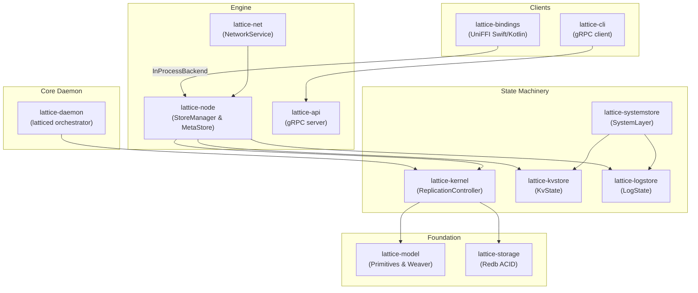

**Lattice** is a local-first, peer-to-peer **replicated state machine engine** written in Rust. It provides an application-agnostic framework for building distributed data structures that synchronize across a mesh of nodes without a central authority. All reads and writes are served from a local embedded database (`redb`), giving zero-latency offline operation, while a QUIC-based networking layer (Iroh) handles encrypted replication across peers.

## Core Protocol: Weaver

The heart of Lattice is the **Weaver Protocol**, a hybrid **Merkle DAG + linearized witness log** architecture:

1. **Intentions (DAG):** Every write produces a `SignedIntention` — a BLAKE3-hashed, Ed25519-signed operation that includes a `Condition` (pointers to prior hashes from the same author and any causally-dependent operations). These form a content-addressed DAG.
2. **Floating resolution:** Out-of-order intentions are buffered as "floating" and indexed by their missing dependency hash. When the dependency arrives, dependents are woken and applied.
3. **Witness log (linearization):** The local node "witnesses" each applied intention by appending it to a monotonic, cryptographically chained `WitnessRecord` log, establishing a local total order.

Serialization is **dual-format**: Borsh for deterministic canonical hashing/signing, Protobuf for wire transport and IPC.

## Storage Architecture

- **`lattice-storage` / `StateBackend`:** Wraps `redb` (embedded ACID KV store in pure Rust). Provides DAG-chain verification (`verify_and_update_tip`), atomic multi-table transactions, and BLAKE3-checksummed snapshot streaming.
- **`lattice-kernel` / `IntentionStore`:** Manages four redb tables — `TABLE_INTENTIONS` (content-addressed ops), `TABLE_WITNESS` (linearized log), `TABLE_FLOATING` (unresolved deps), `TABLE_AUTHOR_TIPS` (per-author DAG tips). The `ReplicationController` actor serializes all writes through an `mpsc` channel while permitting concurrent MVCC reads for sync queries.
- **`lattice-systemstore` / `SystemLayer<S>`:** A **Y-Adapter middleware** that intercepts `UniversalOp` envelopes — routing `SystemOp` (peer governance, store hierarchy, invites) to a reserved `TABLE_SYSTEM` backed by `KVTable` with LWW-CRDT merge semantics, and unwrapping `AppData` ops to the inner `StateMachine`.

## State Machines (Pluggable CRDTs)

State machines are pluggable via the `StateMachine` trait (defined in `lattice-model`). The `Op` passed to `apply()` embeds an `IntentionInfo` (hash, payload, timestamp, author) plus `causal_deps` and `prev_hash`. State machines also receive `&dyn DagQueries` to look up intention metadata from the DAG when needed (e.g. for LWW comparison during concurrent writes).

**`lattice-kvtable` (KVTable)** is the shared conflict-domain engine used by both KV and System stores. Each key stores a materialized value plus a list of intention hashes (pointers into the DAG). LWW resolution happens at **write time** — `apply_head()` compares the incoming intention's HLC/author against the current winner via DAG lookup and updates the materialized value in place. Reads return the resolved value directly with no merge step. HLC, author, and payload are not duplicated on disk — they live in the DAG and are dereferenced on demand.

Two state machines ship:

- **`lattice-kvstore` (KvState):** DAG-CRDT key-value store built on `KVTable`. Supports `watch` streams (regex-filtered) and batch transactions.
- **`lattice-logstore` (LogState):** Append-only log with composite keys `[HLC-BE || PubKey]` giving chronological-then-author ordering. Supports tailing via broadcast channels.

Both expose runtime introspection via embedded `prost-reflect` `FileDescriptorSet`, enabling the CLI and bindings to discover and invoke store methods dynamically without compile-time knowledge.

## Networking Layer

- **Transport:** Built on **Iroh** (QUIC, NAT traversal, mDNS/DHT/pkarr discovery). Custom ALPN (`b"lattice-sync/1"`). Now abstracted behind a `Transport` trait with a `ChannelTransport` for in-memory simulation.
- **Gossip (push):** `GossipManager` maps store UUIDs to gossip topics and broadcasts `SignedIntention`s in real time. Includes gap detection — if a gossipped intention references a missing dep, a unicast `FetchChain` request backfills the history. Outbound lag is tracked per-store (`GossipLagStats`): when the forwarder's broadcast channel overflows or a broadcast fails, drops are counted with timestamps, and `needs_sync()` signals when a full reconciliation pass should be scheduled to recover.
- **Reconciliation (pull):** `lattice-sync::Reconciler` implements a Negentropy-style **set reconciliation** protocol — symmetric, recursive binary subdivision of the 256-bit hash space, comparing range fingerprints to locate divergent regions, falling to explicit item listing below a leaf threshold (32).
- **`NetworkService<T: Transport>`:** Singleton event-driven service. Subscribes to `NetEvent` broadcast channel from the node layer; emits `NetworkEvent`s back. `SessionTracker` maintains volatile presence state (online peers, last-seen).

## Node Orchestration

- **`Node`:** Aggregates `DataDir` (platform-specific paths + `identity.key`), `MetaStore` (local `meta.db` tracking root store inventory), and `StoreManager`.
- **`StoreManager` / `StoreRegistry`:** Manages heterogeneous stores via `Arc<dyn StoreHandle>` (type-erased). Stores are registered by type string (`"kv"`, `"log"`) through `StoreOpener` factories.
- **Fractal Store Model:** Stores form a recursive hierarchy. Root stores are pinned locally; child stores are declared as CRDT entries in the parent's `SystemStore`. A `RecursiveWatcher` subscribes to `ChildAdded` system events and automatically instantiates child stores on the local node.
- **Peer Governance:** Access control is replicated data — peer `Active`/`Revoked`/`Dormant` status lives in the `SystemStore` as CRDTs. Invite tokens use hashed-secret validation. Authorization checks are embedded in `NetworkStore` wrappers so the network layer cannot bypass them.

## Component Layers

## Security Model

The `NetworkService` operates as a **"dumb bouncer"**:

1. **Explicit Registration:** If a store is not registered with the `NetworkService`, all network requests for it are dropped. There is no API to enumerate private databases.
2. **Contextual Authorization:** When receiving data, the network layer asks the registered `NetworkStore` wrapper: *"Is this peer allowed to sync with this store?"* Authorization lives in the `SystemStore`, not the connection layer.
3. **Transport Isolation:** The network layer handles QUIC connections, NAT traversal, and peer discovery (via Iroh), but never interprets application data.

By delegating permission checks to the store boundary rather than the connection boundary, Lattice secures data at the ingestion point.

## Bootstrap Protocol

When a node joins a store for the first time via an invite token:

1. **Handshake:** The joiner connects to the inviter and presents the token. The inviter validates and adds the peer to the store's `SystemStore`.
2. **Initial Clone:** The inviter streams its entire **Witness Log** (the linearized intention sequence) to the joiner. This is more efficient than range-based reconciliation when the joiner has nothing.
3. **Active Sync:** Once the log finishes, the joiner transitions to `Active` state and begins normal Negentropy synchronization with discovered peers.

For child stores discovered via the fractal hierarchy, the `RecursiveWatcher` automatically triggers bootstrap in the background.

## Runtime & Interfaces

- **`lattice-runtime`:** Composition root. `RuntimeBuilder` wires up `Node` + `NetworkService` + optional `RpcServer`. Exposes `LatticeBackend` trait with two implementations:
  - `InProcessBackend` — direct `Arc<Node>` calls (mobile, embedded CLI).
  - `RpcBackend` — gRPC over UDS to a running `latticed` daemon.
- **`lattice-api`:** gRPC services (`NodeService`, `StoreService`, `DynamicStoreService`) over Unix Domain Sockets. Domain↔DTO conversion between `lattice-model` types and Protobuf. Event streaming via `mpsc` channel bridging.
- **`lattice-bindings`:** UniFFI bridge for Swift/Kotlin. Uses a "hidden runtime" pattern (owns a dedicated Tokio runtime). Dynamic Protobuf reflection (`prost-reflect` → `ReflectValue` enum tree) lets mobile apps discover and interact with arbitrary store schemas without recompilation.
- **`lattice-cli`:** REPL with dual-mode backend. Dynamic command execution pipeline: fetches Protobuf descriptors at runtime, parses S-expression input, reflects into `DynamicMessage`, executes, and renders. Includes a Unicode graph renderer (Kahn's algorithm + HLC priority) for visualizing DAG history.
- **`lattice-daemon` (`latticed`):** Thin wrapper — `Runtime::builder().with_rpc().build()`, signal handling, structured tracing.

## Cryptographic Primitives

| Primitive | Algorithm | Purpose |
|-----------|-----------|---------|
| Hash | BLAKE3 (32 bytes) | Content addressing, DAG linkage, fingerprints |
| Signature | Ed25519 | Intention signing, witness signing |
| Clock | Hybrid Logical Clock (HLC) | Causal ordering, LWW conflict resolution |
| Identity | Ed25519 keypair (`identity.key`) | Node identity, bound to Iroh QUIC endpoint |
