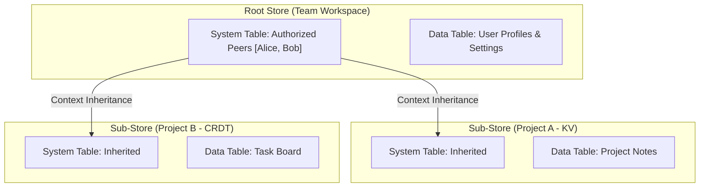

Lattice is fundamentally built around the concept of the **Fractal Store Model**. To maximize flexibility, Lattice provides a self-similar, recursive hierarchy where any component can act as a parent or child.

In Lattice: **Everything is a Store.**

## Unified Store Model

Every store, regardless of its purpose (e.g., KV, Blob, SQL), consists of two storage areas co-located inside its `state.db` file, managed by middleware called `lattice-systemstore`:

1. **System Table (`TABLE_SYSTEM`):** This internal column family tracks peer authorizations (who is allowed to sync), child store references (the hierarchy), and network configuration strategies.
2. **Data Table (`TABLE_DATA`):** Managed by the specific application state machine. This table holds the actual application business data (e.g., chat messages, key-value pairs).

## Root Stores vs Sub-Stores

Because all stores share the same architecture, the distinction between a "Mesh Coordinator" and a "Data Store" is purely relational:

- **Root Store:** A store that acts as the identity and trust anchor for a group. It uses `PeerStrategy::Independent`, meaning it defines its own list of authorized peers via its System Table. It typically doesn't hold much user data, serving mainly as a directory.
- **Sub-Store:** A store that belongs to a Root. It uses `PeerStrategy::Inherited`, meaning it delegates peer authorization to its parent. If a peer is authorized in the Root Store, they automatically gain access to the Sub-Store.

## Context Inheritance

When a node opens a Root Store, the `RecursiveWatcher` service monitors its Intention DAG. When it detects a `ChildAdd` system operation linking a child store, it automatically discovers and instantiates the child store.

This ensures that adding a peer to the Root Store instantly cascades access to all connected children, without requiring the synchronization of distinct peer lists.

## The `meta.db` Global Inventory

To bootstrap the system, every Lattice node maintains a local, non-replicated inventory in `meta.db` (located at the root of the data directory). This global database contains a `rootstores` table, which remembers which Root Stores the user has explicitly joined or created. Upon startup, the Node reads this table and opens the roots, which consecutively triggers the recursive discovery of all linked Sub-Stores.
