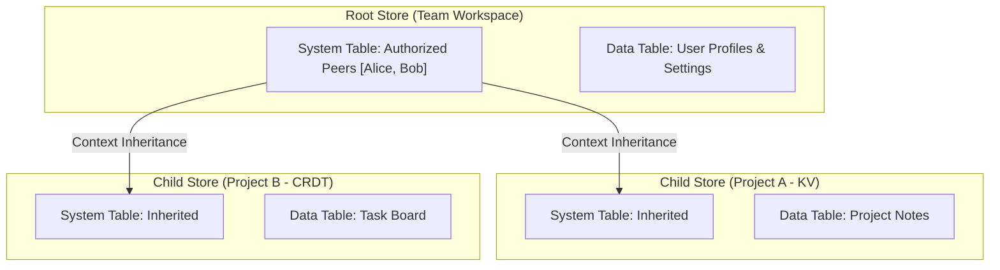

A **store** is the fundamental unit of data in Lattice. It is an independent, replicated database shared between authorized peers. Each store has a UUID, a type (e.g., `core:kvstore`), and its own intention DAG, witness log, and materialized state.

In Lattice: **everything is a store.** Stores form a self-similar, recursive hierarchy — a root store manages peer authorization and child store declarations, while child stores inherit their peer list from the parent.

## Anatomy of a Store

A store on disk consists of two databases:

```
stores/{uuid}/
    intentions/log.db   # Intention DAG + witness log
    state/state.db      # System table + materialized app state
    sync/               # Sync session state
```

### `log.db` — The Replication Layer

Managed by `IntentionStore` (`lattice-kernel`). This is the source of truth that gets replicated across the network. A node can participate in sync and witnessing with only `log.db` — no opener or state machine required.

| Table | Key | Value | Purpose |
|---|---|---|---|
| `TABLE_INTENTIONS` | intention hash (32 bytes) | `SignedIntention` proto | All received intentions, content-addressed |
| `TABLE_WITNESS` | seq (u64 BE) | `WitnessRecord` proto | Ordered witness log — the linearized apply order |
| `TABLE_WITNESS_INDEX` | intention hash (32 bytes) | seq (u64 BE) | Reverse lookup: which seq witnessed this intention? |
| `TABLE_WITNESS_CONTENT_INDEX` | witness content hash | seq (u64 BE) | Content hash to seq lookup |
| `TABLE_AUTHOR_TIPS` | PubKey (32 bytes) | Hash (32 bytes) | Per-author latest witnessed intention |
| `TABLE_FLOATING` | intention hash | `FloatingMeta` proto | Unwitnessed intentions (missing deps) |
| `TABLE_FLOATING_BY_PREV` | store_prev hash | intention hash (multimap) | Reverse index for floating resolution — one prev can have multiple waiting intentions |

`log.db` currently has no meta table — store identity (`store_id`, `store_type`) lives only in `state.db`'s `TABLE_META`. The planned 18B milestone will add `TABLE_LOG_META` so that `log.db` is self-identifying (needed for headless replication and `peek_info()` without `state.db`).

**In-memory derived state** (rebuilt on startup from the tables above):

- `witness_seq` — current witness log head sequence number
- `last_witness_hash` — hash chain head for O(1) witness extension
- `witness_fingerprint` — XOR of all witnessed intention hashes (for Negentropy sync)
- `author_tips` — loaded from `TABLE_AUTHOR_TIPS`

### `state.db` — The Projection Layer

Managed by `StateBackend` (`lattice-storage`) with the `SystemLayer` middleware (`lattice-systemstore`). Always exists — the system table (`TABLE_SYSTEM`) stores the peer list, child store declarations, and invites, which the network layer needs for authorization even before any app data is projected.

`state.db` can always be deleted and rebuilt from `log.db` by replaying the witness log.

| Table | Key | Value | Purpose |
|---|---|---|---|
| `TABLE_META` | string key | varies | Store identity and projection bookkeeping |
| `TABLE_SYSTEM` | string key (e.g., `peer/{pk}/status`) | proto bytes | Replicated system state (peers, children, invites). LWW-CRDT merge via `KVTable` |
| `TABLE_DATA` | varies by store type | varies | Application state (e.g., KV entries, log records) |

**`TABLE_META` keys:**

| Key | Value | Description |
|---|---|---|
| `store_id` | `[u8; 16]` (UUID) | Store identity — verified on open |
| `store_type` | UTF-8 string | Store type — used to resolve the opener |
| `schema_version` | u64 LE | State machine data format version, for migrations |
| `tip/{author_pubkey}` | `[u8; 32]` (Hash) | Per-author chain tip for write integrity checking |
| `last_applied_witness` | `[u8; 32]` (Hash) | Projection cursor — content hash of the last applied witness record |

## Store Lifecycle on a Node

A store's state on any given node depends on two things: whether the node is participating, and whether it has the opener (state machine implementation) for the store type.

| Participating? | Has opener? | Mode | What's on disk |
|---|---|---|---|
| No | -- | **Inactive** | Nothing, or stale data from a previous session |
| Yes | Yes | **Active** | `log.db` + `state.db` — full projection, app queries work |

Currently, a store requires a registered opener to be opened at all. If no opener is available for the store type, `StoreManager::open()` returns `NoOpener`. A future "replicating" mode would allow a node to sync and witness intentions without an app opener, using `SystemLayer<NullState>` as a fallback — the system leg would still run (peers, children, invites) while app data remains unprocessed.

## The Two Legs

Every intention payload is a `UniversalOp` protobuf envelope containing either a `SystemOp` or `AppData`:

```
UniversalOp {
    oneof op {
        SystemOp system = 11;   // Peer management, child stores, invites
        bytes app_data = 10;    // Application-specific (KV put/delete, etc.)
    }
}
```

The `SystemLayer` middleware routes these independently:

- **System leg** (`SystemOp` → `TABLE_SYSTEM`): Always processed. Manages peers, child store declarations, invites, store name. `SystemState` is built into the framework — every store type gets it automatically.
- **App leg** (`AppData` → `TABLE_DATA`): Processed by the store's state machine (e.g., `KvState`, `LogState`). The app state machine is pluggable; `SystemLayer<S>` routes app payloads to `S::apply()`.

## Sync and Fingerprints

Negentropy set reconciliation operates over **witnessed intentions only**. The `witness_fingerprint` (XOR of all witnessed intention hashes) provides O(1) divergence detection. Range queries (`fingerprint_range`, `count_range`, `hashes_in_range`) scan `TABLE_WITNESS_INDEX` to locate differences.

Floating (unwitnessed) intentions are excluded from sync — they are local buffer state, not shared consensus. Every intention is witnessed on at least its origin node, so Negentropy will always discover it through that node's witnessed set.

See [Weaver Protocol Specification](../protocol/weaver.md) for the full data model and validation rules.

## Store Hierarchy

### Root Stores vs Child Stores

Because all stores share the same architecture, the distinction between a "Mesh Coordinator" and a "Data Store" is purely relational:

- **Root Store:** Acts as the identity and trust anchor for a group. Uses `PeerStrategy::Independent`, meaning it defines its own list of authorized peers via its System Table. Typically doesn't hold much user data, serving mainly as a directory.
- **Child Store:** Belongs to a root (or another parent). Uses `PeerStrategy::Inherited`, meaning it delegates peer authorization to its parent. If a peer is authorized in the Root Store, they automatically gain access to the child store.

The `PeerStrategy` enum has three variants: `Independent` (manages own peer list), `Inherited` (live reference to parent's peer list), and `Snapshot` (copies parent's peers at creation but diverges thereafter). In practice, root stores are Independent and child stores are Inherited.

### Context Inheritance

When a node opens a Root Store, the `RecursiveWatcher` service subscribes to projected system events. When it receives a `ChildLinkUpdated` or `ChildStatusUpdated` event, it automatically discovers and instantiates the child store.



Adding a peer to the Root Store instantly cascades access to all connected children, without requiring the synchronization of distinct peer lists.

### The `meta.db` Global Inventory

Every Lattice node maintains a local, non-replicated inventory in `meta.db` (located at the root of the data directory). This database contains three tables:

- `rootstores` — which Root Stores the user has explicitly joined or created
- `stores` — all known stores (root and child) with parent ID, store type, and creation time
- `meta` — node-level metadata (e.g., display name)

Upon startup, the Node reads the `rootstores` table and opens each root, which triggers the recursive discovery of all linked child stores.
