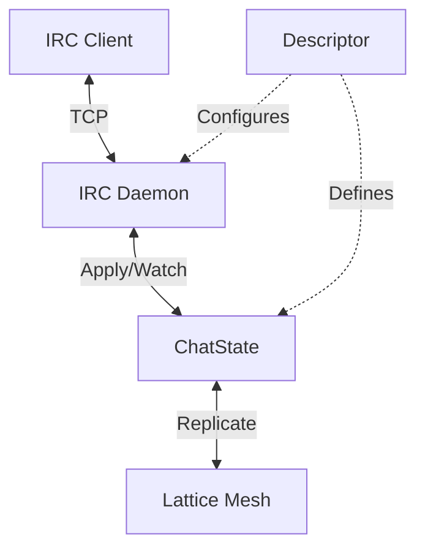

> **Status**: Unimplemented design. Preserved for future reference. The current daemon (`latticed`) is thin and does not follow this model.

Services allow Lattice nodes to interact with the outside world (TCP/HTTP/SSH) or perform background maintenance. This document defines how services could be **declared**, **configured**, and **orchestrated** across the mesh.

## Core Concepts

### 1. Service Manifest (Definition)

Defines *what* a service is. Currently, these are compiled-in Rust modules (crate feature flags), but future versions may support Wasm or external binaries.

```rust
pub trait ServiceProvider {
    fn id(&self) -> &str; // e.g. "lattice.irc-gateway"
    fn schema(&self) -> ServiceSchema; // Config validation
    fn factory(&self) -> Box<dyn ServiceFactory>;
}
```

### 2. Service Registry (Cluster Configuration)

Services are declared cluster-wide in the **System Table (rootstores)** (the coordination layer). This allows coherent configuration management across the mesh.

**Storage Path:** `/services/{service_id}/config`

### 3. Node Assignment (Runtime)

Each node watches the System Table. If a node matches the `policy` for a service, it instantiates the service locally.

- **Global**: Runs on every node in the mesh (e.g., `HealthCheck`).
- **LocalOnly**: Configured only in local `meta.db`.
- **TaggedNodes**: Runs on nodes with specific tags (e.g., `IRC-Gateway`).

## The External Daemon Pattern

To ensure stability and security, **Daemons should be external processes**.

The `lattice-node` core should remain small, focused, and rock-solid. All application logic runs in separate processes that communicate via a simple **Lattice Store Protocol** (RPC).

### Architecture: The "Kernel & User-Space" Model

1. **Lattice Node (The Kernel)**
   - Manages the Disk (DB), The Network (P2P), and Consistency (Conflict Resolution).
   - Exposes a **Unix Domain Socket** (or localhost TCP).
   - Does **NOT** know about IRC, HTTP, or FUSE.

2. **Daemons (User Space)**
   - Standalone binaries: `lattice-irc`, `lattice-fuse`, `lattice-web-gateway`.
   - Connect to the Node's socket.
   - Authenticate with a **Service Token**.
   - Send simple Ops: `put(key, val)`, `watch(prefix)`.

### Benefits

- **Crash Isolation**: If `lattice-irc` panics, the Node stays up.
- **Security**: The Node enforces ACLs on the socket.
- **Polyglot**: Write a daemon in Python, Go, or Node.js.
- **Distribution**: `cargo install lattice-irc` is optional.

## The Lattice Application Bundle

A deployable unit consists of three pillars:

1. **State Machine (The "Brain")**
   - **Responsibility**: Deterministic business logic, data persistence, conflict resolution.
   - **Nature**: Passive, Replicated, Durable.

2. **Daemon (The "Body")**
   - **Responsibility**: Side-effects, I/O, bridging to the outside world (TCP/HTTP/SSH), reacting to changes.
   - **Nature**: Active, Ephemeral, Local.

3. **Service Descriptor (The "Passport")**
   - **Responsibility**: Metadata, configuration schema, deployment policy, discovery.
   - **Nature**: Static, Declarative.



## OS Integration Patterns

The "Daemon" concept encapsulates **ANY** side-effect or OS integration:

- **TCP Port ↔ Chat Log** (IRC Gateway)
- **FUSE Mount ↔ File Tree** (Shared Drive)
- **TUN Interface ↔ IP Routing Table** (VPN)
- **Desktop Notification ↔ Alert Log**

## Security: The "Remote Control" Problem

**Risk**: If the root store syncing is automatic, a malicious peer with write access to the root store could push a config that causes your node to run arbitrary code. This is Remote Code Execution (RCE) via configuration.

**Mitigation**: Consent-Based Activation

1. **Cluster Config = "Intention"**: "The mesh administrator *suggests* that all 'gateway' nodes run IRC on 6667."
2. **Local Config = "Consent"**: The local node must explicitly **opt-in** to managing services via the mesh.

```rust
fn should_run(&self, service_id: &str, policy: Policy) -> bool {
    let local_consent = self.meta.get_service_consent(service_id);
    
    match local_consent {
        Consent::AlwaysAllow => true,
        Consent::Block => false,
        Consent::FollowMesh => self.matches_policy(policy),
        Consent::Manual => false, // Default: safe
    }
}
```

The **Consent Firewall** is essential — without it, this architecture turns a P2P mesh into a botnet command-and-control system.

## Comparative Analysis

| System | Approach | What Lattice Borrows |
|--------|----------|---------------------|
| **Kubernetes** | Central control plane pushes intent; Kubelets blindly obey. | Declarative Config (Reconciliation Loops). Reject unchecked obedience. |
| **Systemd** | Unit files on disk; `systemctl enable` activates. | Unit Model (Dependencies, Restart Policy). Add Mesh Control Plane. |
| **Cap'n Proto / Sandstorm** | Services isolated grains with explicit capabilities. | "Consent Firewall" (simplified capability model). |
