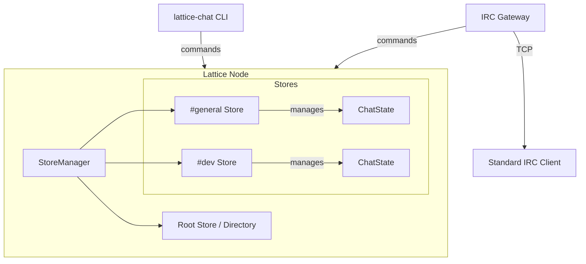

> **Status**: Design template. Not implemented. Useful as a reference for building applications on Lattice.

A decentralized, offline-first, IRC-like chat application demonstrating Lattice as a generic Replicated State Machine (RSM) platform.

## Architecture

The ChatRoom application demonstrates that Lattice is not just a Key-Value store, but a platform for any deterministic state machine. We implement a custom `ChatState` optimized for message logs.



## Data Model

### `ChatState` (StateMachine)

Instead of using `KvState`, we implement `StateMachine` directly to store an ordered log of messages. This is more efficient than KV for chat logs (no key storage overhead, optimized for "append & scan").

**State Structure:**

```rust
struct ChatState {
    // Ordered list of messages (by logical clock / causal order)
    messages: Vec<Message>,
    // Index for quick lookups (e.g. by ID for replies/reactions)
    index: HashMap<Hash, usize>,
}

struct Message {
    id: Hash,           // Intention DAG Intention Hash
    author: PubKey,
    timestamp: HLC,
    content: MessageType,
    reactions: HashMap<String, Vec<PubKey>>, // emoji -> authors
}

enum MessageType {
    Text(String),
    Reply { reply_to: Hash, text: String },
}
```

**Operations (Ops):**
- `Post(text)`: Append new message.
- `Reply(hash, text)`: Append reply (client renders threading).
- `React(hash, emoji)`: Update existing message state (CRDT map logic).

### Channel Management (Root Store)

Channels are just valid Lattice Stores. We use the **Root Store** (which uses `KvState`) as the channel directory.

- **Key**: `/channels/{name}`
- **Value**: `{ "store_id": "uuid...", "created_at": "..." }`

Joining a channel `#general` involves:
1. Check root store for `/channels/#general`.
2. If exists, get `store_id` and open that store.
3. If not, create new store, register in root store.

## CLI Interface

A subcommand or standalone binary `lattice-chat`:

```bash
# Start the chat daemon/client
lattice chat init --name "Alice"

# List channels (from root store)
lattice chat list

# Join a channel (opens store, starts syncing)
lattice chat join #general

# Send message
lattice chat msg #general "Hello world!"

# TUI Mode (Interactive)
lattice chat tui
```

## IRC Gateway (TCP Server)

To support existing clients (Textual, Irssi, WeeChat), implement a translation layer.

- **Listen**: `127.0.0.1:6667`
- **Protocol**: subset of IRC (RFC 1459).
- **Mapping**:
  - `JOIN #channel` -> Open Store, Sync.
  - `PRIVMSG #channel :msg` -> `ChatState::apply(Post(msg))`.
  - `Topic` -> `ChatState` metadata.
  - `Names` -> List of peers (authors) seen in the Intention DAG.

## Technical Considerations

- **Causal Ordering**: Messages should be sorted by causal history (Lamport/Vector clocks implicit in Intention DAG). `ChatState` appends in apply order, which is causally consistent by definition of the Intention DAG.
- **Conflicting Reacts**: Reactions are a set. CRDT "Add Wins" logic is implicit since operations are additive.
- **Pruning**: Chat logs grow forever. Future work: `snapshot` and `truncate`.

## Implementation Plan

### Phase 1: The Chat Engine
- Define `ChatState` implementing `StateMachine`.
- Implement `apply()` logic for Post/Reply/React.
- Implement `ChatRoom` high-level API (wraps `Store<ChatState>`).

### Phase 2: Channel Directory
- Define schema for Root Store channel registry.
- Implement `ChannelManager` to handle join/leave/create flows.

### Phase 3: CLI
- Basic TUI using `ratatui` or simple readline loop.
- Watch mode for real-time updates.

### Phase 4: IRC Gateway
- Async TCP server handling IRC protocol.
- Map IRC commands onto Lattice ops.
