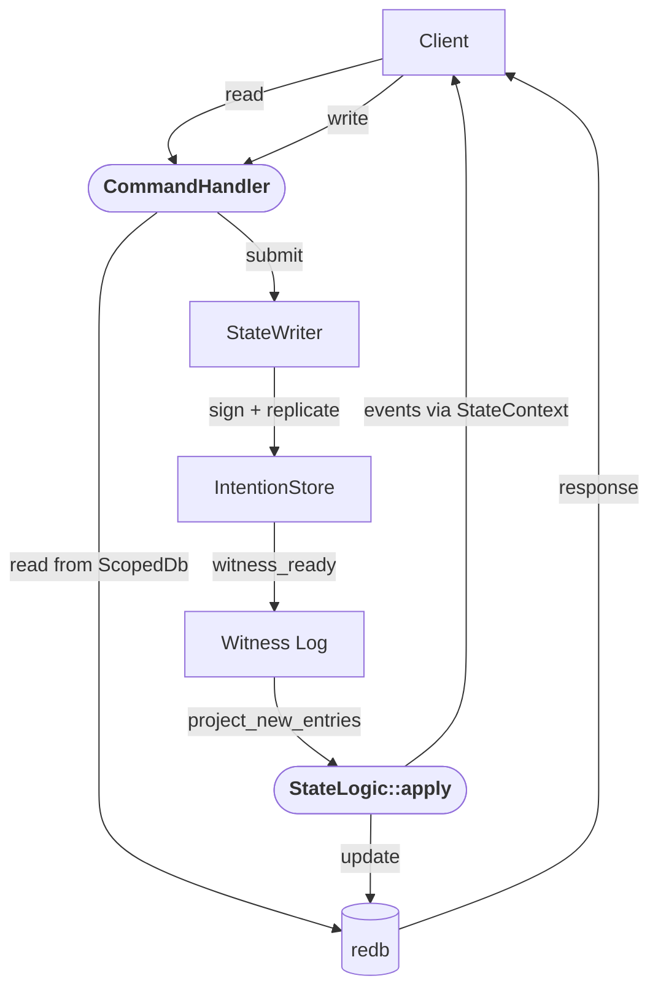

How to implement a custom Lattice state machine.

## Overview

A Lattice store is a replicated database shared between peers. Each store has a state machine that defines its behavior. The state machine has two responsibilities:

1. **Handle commands.** Clients send commands (e.g., `Put`, `Get`, `Delete`) through the `CommandHandler`. Write commands validate input, encode it as a protobuf payload, and submit it via a `StateWriter`. Read commands query the local database directly. The `CommandHandler` cannot modify the database; it can only read and submit intentions.

2. **Apply intentions.** When an intention is committed to the witness log (either from this node or a peer), the framework calls `StateLogic::apply()` with a writable table reference. The state machine decodes the payload and updates its state. Every node applies the same set of intentions, so all nodes converge to the same state.

The `StateWriter` is the bridge between commands and the replication engine. Calling `writer.submit(payload, causal_deps)` creates a signed intention, inserts it into the local store, gossips it to peers, and returns the intention hash. The payload bytes are opaque to the framework; only your `apply()` knows how to decode them.

Each `submit()` call creates one intention, which results in one `apply()` call. For atomic multi-operation writes, pack all operations into a single payload and submit once. For example, `KvState` supports a `Batch` command that encodes multiple put/delete operations into one `KvPayload` and submits it as a single intention. Calling `submit()` multiple times within one command creates independent intentions with no atomicity guarantee between them.

## What You Implement

A state machine is a struct that implements these traits:

| Trait | Purpose |
| :---- | :------ |
| `StateLogic` | Core logic: decode payloads, update state, notify watchers |
| `CommandHandler` | Client API: validate input, submit intentions, handle reads |
| `Introspectable` | Schema discovery for CLI and bindings |
| `StreamProvider` | Reactive subscription streams |

The framework wraps your struct in `SystemLayer<YourState>`, which handles transactions, chain validation, and system operations. You never implement `StateMachine` directly.

The production type stack is `Store<SystemLayer<YourState>>`.

## StateContext

Every state machine holds a `StateContext<E>`, which bundles a read-only database handle with a broadcast channel for events:

```rust
pub struct StateContext<E: Clone + Send> { /* db + event_tx */ }

impl<E: Clone + Send> StateContext<E> {
    pub fn new(db: ScopedDb) -> Self;
    pub fn db(&self) -> &ScopedDb;
    pub fn subscribe(&self) -> broadcast::Receiver<E>;
    pub fn notify(&self, events: Vec<E>);
}
```

The `ScopedDb` inside is a read-only handle scoped to a single redb table. For application state machines this is `TABLE_DATA`. Use it for queries outside the apply path (e.g., `get`, `list`, `scan`). You cannot access other tables.

`notify()` dispatches events to watchers after the framework commits the transaction. `apply()` returns events as data; the framework calls `context().notify(events)` only after a successful commit. Watchers only see committed state.

## StateLogic

The core trait. Your state machine decodes payloads and mutates a redb table.

```rust
pub trait StateLogic: Send + Sync {
    type Event: Clone + Send;

    fn store_type() -> &'static str where Self: Sized;
    fn context(&self) -> &StateContext<Self::Event>;
    fn apply(
        &self,
        table: &mut Table<&[u8], &[u8]>,
        op: &Op,
        dag: &dyn DagQueries,
    ) -> Result<Vec<Self::Event>, StateDbError>;
}
```

State machines also implement `From<StateContext<E>>` so the framework can construct them generically.

### Minimal example

```rust
pub struct CounterState {
    ctx: StateContext<CounterEvent>,
}

impl From<StateContext<CounterEvent>> for CounterState {
    fn from(ctx: StateContext<CounterEvent>) -> Self {
        Self { ctx }
    }
}

impl StateLogic for CounterState {
    type Event = CounterEvent;

    fn store_type() -> &'static str { "myapp:counter" }

    fn context(&self) -> &StateContext<Self::Event> { &self.ctx }

    fn apply(
        &self,
        table: &mut Table<&[u8], &[u8]>,
        op: &Op,
        dag: &dyn DagQueries,
    ) -> Result<Vec<Self::Event>, StateDbError> {
        let payload = CounterPayload::decode(op.info.payload.as_ref())?;
        // ... mutate table ...
        Ok(vec![CounterEvent::Incremented(payload.delta)])
    }
}
```

### store_type()

Returns a unique identifier for your store type (e.g., `"core:kvstore"`, `"myapp:counter"`). Convention is `namespace:name`. Core types use `core:*`. Stored in the database on creation; opening an existing store with a different type fails.

### apply()

Called inside a write transaction with `TABLE_DATA` already open. Decode `op.info.payload`, update the table, and return events for watchers.

The `Op` contains:
- `info.hash`: intention hash (unique ID)
- `info.payload`: your protobuf-encoded operation bytes
- `info.timestamp`: HLC timestamp
- `info.author`: author's public key
- `causal_deps`: parent hashes this operation supersedes (for conflict resolution)
- `prev_hash`: previous operation in the author's chain

The `dag` parameter lets you query the intention DAG. Useful for conflict resolution, e.g., comparing timestamps of concurrent writes via `dag.find_lca()`.

**If `apply()` returns `Err`**, state projection pauses. The intention is already committed to the witness log; sync and other authors continue normally. The local user sees stale state until the issue is resolved (e.g., code upgrade). This prevents silent state divergence across nodes.

`apply()` should only fail for things the local node can't handle: unknown payload format, I/O errors, corruption. Semantic validation (e.g., "key must not be empty") belongs in `CommandHandler`, before the payload is signed into an intention.

If your state machine has no watchers, use `type Event = ()` and return an empty vec.

## CommandHandler

The client API. Dispatches both reads and writes by method name.

```rust
pub trait CommandHandler: Send + Sync {
    fn handle_command<'a>(
        &'a self,
        writer: &'a dyn StateWriter,
        method_name: &'a str,
        request: DynamicMessage,
    ) -> Pin<Box<dyn Future<Output = Result<DynamicMessage, ...>> + Send + 'a>>;
}
```

**Write commands** (e.g., `Put`, `Delete`) use the `writer` to submit intentions:

```rust
async fn handle_put(
    &self,
    writer: &dyn StateWriter,
    req: PutRequest,
) -> Result<PutResponse, Box<dyn std::error::Error + Send + Sync>> {
    validate_key(&req.key)?;

    // Read current heads for causal dependency tracking
    let causal_deps = self.head_hashes(&req.key)?;

    // Build the payload that apply() will decode later
    let payload = MyPayload { key: req.key, value: req.value };
    let bytes = payload.encode_to_vec();

    // Submit creates a signed intention and sends it to the kernel.
    // Returns the intention hash once the kernel has accepted it.
    let hash = writer.submit(bytes, causal_deps).await?;

    Ok(PutResponse { hash: hash.to_vec() })
}
```

`writer.submit(payload, causal_deps)` is async. It encodes the payload into a signed intention, inserts it into the local `IntentionStore`, and returns the intention hash. The intention is then gossiped to peers, witnessed, and eventually projected through your `apply()`.

The `causal_deps` parameter declares which prior operations this intention supersedes. For a key-value store, this is the set of current head hashes for the key being modified. For an append-only log, this is typically empty. Causal deps enable conflict detection: if two authors submit intentions with the same deps, both are valid but the state machine must merge them deterministically.

**Read commands** (e.g., `Get`, `List`) read directly from `ScopedDb` and return the result. No intention is created. The `writer` parameter is ignored.

`CommandHandler` cannot modify the database. `ScopedDb` only opens read-only transactions, and `writer.submit()` only creates an intention. The writable table reference only exists in `StateLogic::apply()`, which the framework calls during projection.

## Introspectable

Enables the CLI and language bindings to discover your schema at runtime.

```rust
pub trait Introspectable: Send + Sync {
    fn service_descriptor(&self) -> ServiceDescriptor;
    fn decode_payload(&self, bytes: &[u8]) -> Result<DynamicMessage, ...>;
    fn command_docs(&self) -> HashMap<String, String>;
    fn field_formats(&self) -> HashMap<String, FieldFormat>;
    fn summarize_payload(&self, msg: &DynamicMessage) -> Vec<SExpr>;
}
```

To wire this up:

1. **Define a `.proto` file** with three sections:

   The **service** defines the commands clients can call. Each RPC method maps to a `CommandHandler` dispatch:
   ```protobuf
   service CounterStore {
       rpc Increment (IncrementRequest) returns (IncrementResponse);
       rpc Get (GetRequest) returns (GetResponse);
   }
   ```

   The **request/response messages** define the schema for each command:
   ```protobuf
   message IncrementRequest { int64 amount = 1; }
   message IncrementResponse { bytes hash = 1; }
   message GetRequest {}
   message GetResponse { int64 value = 1; }
   ```

   The **payload message** defines what gets written into intentions. This is what `apply()` decodes. It can differ from the request messages (the command may transform or combine fields before building the payload):
   ```protobuf
   message CounterPayload { int64 delta = 1; }
   ```

2. **In `build.rs`**, compile the proto into a binary `FileDescriptorSet`:
   ```rust
   prost_build::Config::new()
       .file_descriptor_set_path(out_dir.join("counter_descriptor.bin"))
       .compile_protos(&["proto/counter.proto"], &["proto/"])?;
   ```

3. **Embed the descriptor bytes** in your crate:
   ```rust
   pub const DESCRIPTOR_BYTES: &[u8] =
       include_bytes!(concat!(env!("OUT_DIR"), "/counter_descriptor.bin"));
   ```

4. **At runtime**, decode into a `prost_reflect::DescriptorPool` (cache in a `OnceLock`). `service_descriptor()` returns the service from the pool. `decode_payload()` uses the pool's message descriptor to decode intention bytes into a `DynamicMessage` for CLI display.

## StreamProvider

Exposes reactive subscription streams (e.g., watch a key pattern for changes).

```rust
pub trait StreamProvider {
    fn stream_handlers(&self) -> Vec<StreamHandler<Self>>;
}
```

Each handler has a descriptor (name, param schema, event schema) and a subscriber factory. State machines typically use `tokio::sync::broadcast` internally, then filter and encode in the stream handler.

Required trait bound, but return an empty vec if your store doesn't need subscriptions.

## Data Flow



Rounded nodes are your code. Square nodes are framework internals.

## Conflict Resolution

Multiple authors can submit intentions concurrently. When this happens, each node may witness them in a different order, but every node sees the same set of intentions. Your `apply()` must produce the same result regardless of order.

Strategies:
- **Last-Writer-Wins (LWW)**: Compare HLC timestamps. The `KVTable` engine does this automatically.
- **Custom merge**: Use `dag.find_lca()` to find the common ancestor and merge branches.
- **Append-only**: No conflicts by construction (e.g., `LogState`).

The `causal_deps` field in `Op` tells you which prior operations this one supersedes. Use it to track heads and detect conflicts.

## Reference: NullState

`lattice-mockkernel/src/null_state.rs` — minimal implementation of all required traits. Use it as a starting point.

## Reference: KvState

`lattice-kvstore/src/state.rs` — full implementation with LWW conflict resolution, watch streams, protobuf introspection. The best example of a production state machine.
