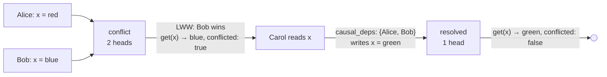

A replicated key-value store with LWW (Last-Writer-Wins) conflict resolution. Keys and values are opaque byte strings. Store type: `core:kvstore`.

## Data Model

Each key maps to a `Value` on disk:

```protobuf
message Value {
    oneof kind {
        bytes value = 1;
        bool tombstone = 2;
    }
    repeated bytes heads = 3;
}
```

`kind` holds the LWW winner's value (or a tombstone for deletes). `heads` tracks all causally concurrent intention hashes — `heads[0]` is the winner, the rest are losers whose values have been discarded. Only their hashes are retained for conflict awareness.

## Commands

### Put

Write a key-value pair. Returns the intention hash.

```protobuf
message PutRequest { bytes key = 1; bytes value = 2; }
message PutResponse { bytes hash = 1; }
```

### Delete

Delete a key by writing a tombstone. Returns the intention hash.

```protobuf
message DeleteRequest { bytes key = 1; }
message DeleteResponse { bytes hash = 1; }
```

### Batch

Atomic batch of puts and deletes. All operations are applied as a single intention — other nodes see either all of them or none.

```protobuf
message Operation {
    oneof op_type {
        PutOp put = 1;
        DeleteOp delete = 2;
    }
}
message BatchRequest { repeated Operation ops = 1; }
message BatchResponse { bytes hash = 1; }
```

If the same key appears more than once, only the last operation for that key is kept. The batch collects causal deps from all affected keys (the union of their current head hashes), so the resulting intention causally depends on the prior state of every key it touches. This means a batch that writes to keys `x` and `y` will resolve any existing conflicts on both keys.

## Queries

### Get

Read a key's LWW winner value. The `conflicted` flag is `true` when concurrent writes exist (`heads.len() > 1`), even though the returned value is always deterministic.

```protobuf
message GetRequest { bytes key = 1; }
message GetResponse { optional bytes value = 1; bool conflicted = 2; }
```

### List

List key-value pairs matching a byte prefix. Each entry includes the `conflicted` flag.

```protobuf
message ListRequest { bytes prefix = 1; }
message ListResponse { repeated KeyValuePair items = 1; }
message KeyValuePair { bytes key = 1; bytes value = 2; bool conflicted = 3; }
```

### Inspect

Full conflict state for a single key. Returns the head set — all causally concurrent intention hashes — along with the winner's value and tombstone status.

```protobuf
message InspectRequest { bytes key = 1; }
message InspectResponse {
    bytes key = 1;
    bool exists = 2;
    optional bytes value = 3;
    bool tombstone = 4;
    bool conflicted = 5;
    repeated bytes heads = 6;
    uint32 head_count = 7;
}
```

## Conflict Resolution

Every write to a key records which prior state the writer observed (via `causal_deps` — the intention hashes the writer had seen). When two peers write to the same key without having seen each other's write, the system detects a **conflict**: two causally independent writes to the same key.

Conflicts are resolved automatically using **Last-Writer-Wins (LWW)**. The write with the higher HLC timestamp wins. If timestamps are equal, the higher PubKey breaks the tie deterministically. Every node applies the same rule, so all replicas converge to the same winner regardless of the order they receive writes.

The losing value is discarded, but its intention hash is retained in the `heads` list. This lets the system report that a conflict occurred — `get()` and `list()` return a `conflicted` flag when `heads.len() > 1`. Applications that care about conflicts can check this flag or use `inspect()` to see all head hashes.

A subsequent write that causally depends on all current heads (i.e., the writer read the key after both conflicting writes arrived) **resolves the conflict** — the old heads are subsumed, and the head set collapses back to a single entry.



This is order-independent: applying the same set of intentions in any order produces the same winner and head set.

## Watch Stream

A prefix-based event stream. Clients subscribe with a byte prefix; the store emits events for keys matching `key.starts_with(&prefix)`.

```protobuf
message WatchParams { bytes prefix = 1; }

message WatchEventProto {
    bytes key = 1;
    oneof kind {
        bytes value = 2;
        bool deleted = 3;
    }
}
```

Events carry the LWW winner value only — no `conflicted` flag. Use `inspect()` to query conflict state. Idempotent replays (same intention hash already in heads) produce no events. However, a new concurrent write that loses LWW still emits an event re-broadcasting the existing winner's value.
